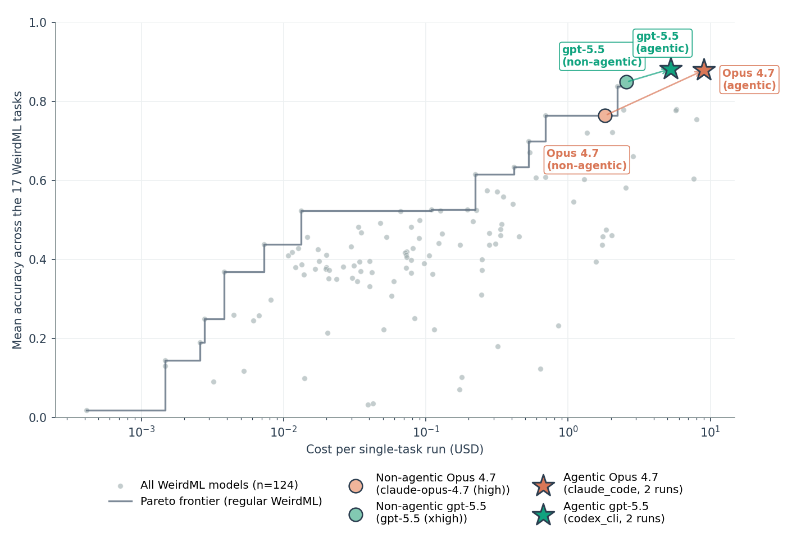
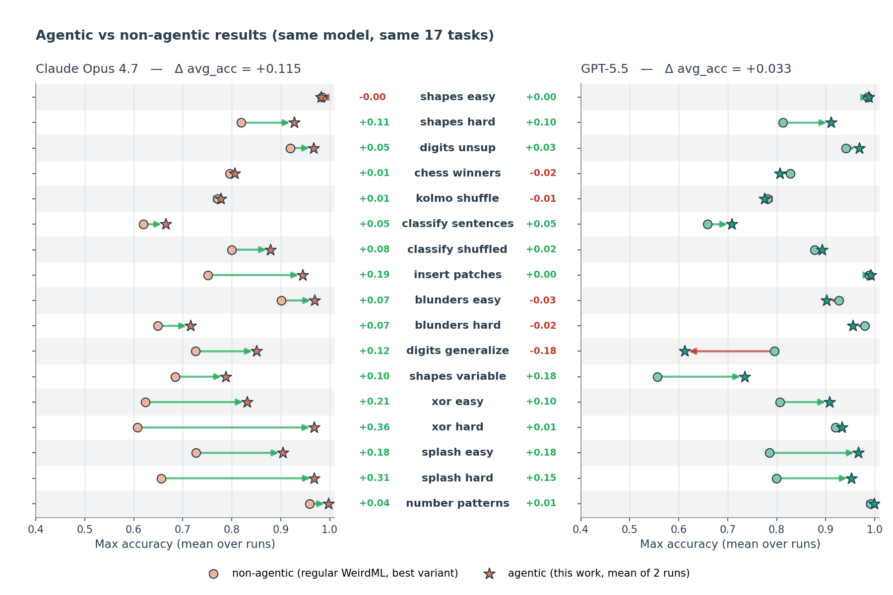
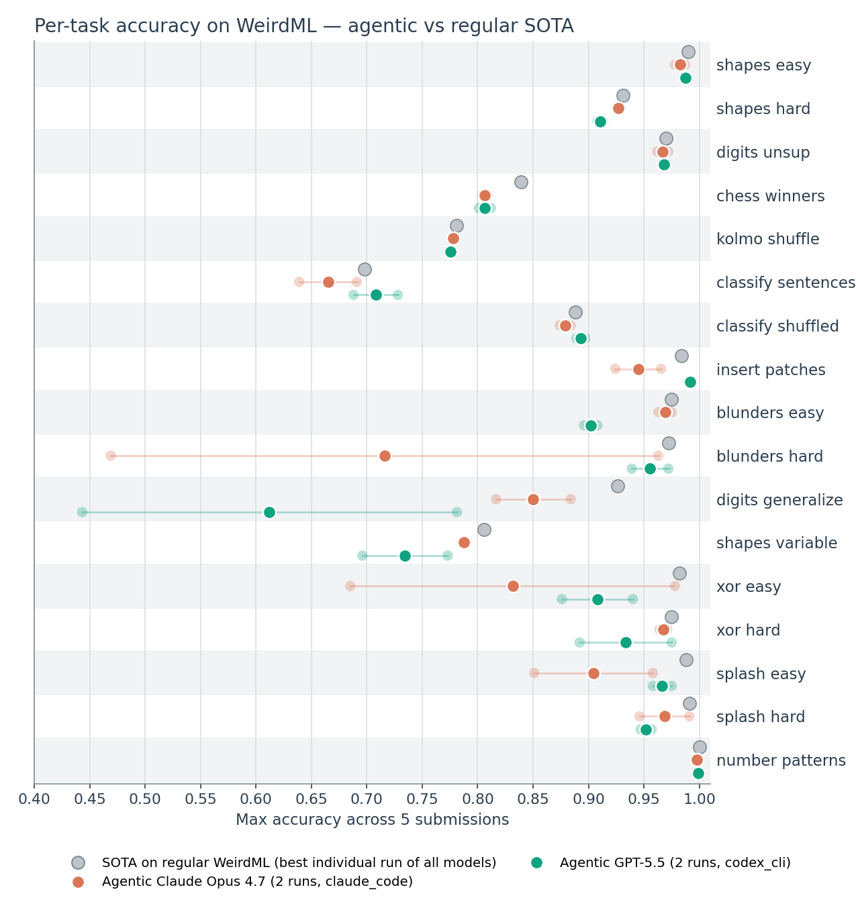

# Agentic WeirdML

  Back to the main <a href="weirdml.html">WeirdML</a> page.

## Introduction

This page reports an **agentic** variant of the WeirdML benchmark, where
instead of submitting code "blind" for a single scored execution the model
drives a coding agent that can freely explore the data and iterate before it
commits to an answer. Two frontier models were evaluated — **GPT-5.5**
(`codex_cli` harness) and **Claude Opus 4.7** (`claude_code` harness) — on the
same 17 tasks, hidden test labels, and grading as the regular benchmark, so
the scores are directly comparable.

The setup mirrors the regular WeirdML grading as closely as possible:

- **Harnesses.** GPT-5.5 was run with `codex_cli` and Opus 4.7 with
  `claude_code`, both inside the [Inspect AI](https://inspect.aisi.org.uk/)
  framework. Each agent ran in a Docker sandbox **with no internet access**.
- **Resources.** The agent had full access to the training data and a GPU,
  and a budget of **20M total tokens per task** to explore, train, and
  test on the training data.
- **Submissions.** As in the regular benchmark, the model could **submit
  code up to 5 times**; each submission is run on the train/test data and
  scored against the hidden test labels exactly as a regular WeirdML
  submission would be. The best of the (up to) five submissions counts.
- **Runs.** Two full 17-task runs were done per model. The two runs differ
  only in how the submission is delivered: as **plaintext code**, or as a
  **path** to a code file already written in the sandbox. Both models
  scored slightly higher on the path runs (Opus 4.7: 90.5% vs. 85.3%;
  GPT-5.5: 89.1% vs. 87.4%), but with only one run per mode it is not clear
  this difference is significant.

Averaged over two runs, **GPT-5.5 scored 88.3%** and **Claude Opus 4.7
scored 87.9%**. Both are well ahead of their non-agentic counterparts on
the regular benchmark, but still short of the known per-task upper bound of
**92.3%** (the average, over the 17 tasks, of the best score any model has
ever achieved on each task).

A full run covers all 17 tasks, and the two runs per model cost **\$179 in
total for GPT-5.5** and **\$305 for Opus 4.7**. Spread over the 34 single-task
runs that represents, that is roughly **\$5 per task-run for GPT-5.5** and
**\$9 for Opus 4.7** — more than the non-agentic runs, but only by a factor of
a few, well under a single order of magnitude. On the cost-vs-accuracy
landscape (Figure 1) the agentic runs land just past the regular-benchmark
Pareto frontier, the premium reflecting the many model calls the agents make
while iterating.

  
  
<strong>Figure 1.</strong> Mean accuracy vs. cost per single-task run, on a log cost axis. Grey points are all model configurations on the regular WeirdML benchmark, with the regular-benchmark Pareto frontier drawn through them. The two agentic runs (stars) and the same models' best non-agentic configurations (circles) are highlighted; arrows connect each model's non-agentic point to its agentic point.

## Compared to the non-agentic benchmark

Holding the model fixed and comparing each agentic result to the same
model's best non-agentic configuration on the regular benchmark shows the
size of the effect. The scaffold lifts **Claude Opus 4.7** from **76.4%** to
**87.9%** and **GPT-5.5** from **84.9%** to **88.3%** (the non-agentic
baselines are the `claude-opus-4.7 (high)` and `gpt-5.5 (xhigh)`
configurations). That accuracy gain comes at roughly **5×** the cost per
task-run for Opus 4.7 (about \$1.8 → \$9.0) and only about **2×** for GPT-5.5
(about \$2.6 → \$5.3).

  
  
<strong>Figure 2.</strong> Agentic vs. non-agentic accuracy for the same model on each task. Each arrow runs from the model's best non-agentic score on the regular benchmark to its agentic score (green where the agent helps, red where it hurts); the number beside each task is the difference. Averaged over the 17 tasks, the agentic scaffold adds <strong>+11.5 points</strong> for Opus 4.7 and <strong>+3.3 points</strong> for GPT-5.5.

The more interesting part is *how* the gap to the non-agentic results closes.
The agentic models did not, for the most part, set new peak scores on
individual tasks. Instead they **much more reliably landed close to optimal
on every task** — the agentic scaffold removes most of the catastrophic
under-performance that single-shot submission occasionally produces, rather
than raising the ceiling.

  
  
<strong>Figure 3.</strong> Per-task accuracy for the two agentic models (each shown as two faded dots for the individual runs and a solid dot for the mean), against the best score recorded by any model on the regular, non-agentic WeirdML benchmark (grey). Tasks are in the canonical WeirdML order. On most tasks both agentic models sit right up against the regular-benchmark frontier; the remaining gap to the grey points is concentrated in a handful of harder tasks.

## An unintended exploit: shipping pre-trained weights

One behaviour is worth flagging because it was not the intended use of the
submission mechanism. In the **path-submission** runs, both models
discovered that they could train a model in their own sandbox, **encode the
trained weights as a long base64 (or zlib+base64) string**, paste that
string into the submission file, and decode it at grading time. The
submitted script then only has to run *inference* on the test set, rather
than train a model from scratch within the 120-second submission limit.

Opus 4.7 did this on **5 of the 17 tasks** and GPT-5.5 on **4**. With one
exception, the weight-embedding submissions did not beat the best known
regular-WeirdML score for the task — the exception being **GPT-5.5 on
`insert_patches`, where both of its runs set a new state of the art**. This
behaviour does not violate the rules (the script is still a self-contained
submission graded on the hidden test labels), and it is not clear it made
much difference to the scores, so these results are left to stand. It is
only available in the path-submission mode: in plaintext mode a
multi-megabyte weight blob would consume the entire token budget, and
indeed neither model attempted it there.

## Notes and next steps

These agentic runs are a side experiment alongside the main WeirdML
benchmark; the headline WeirdML numbers elsewhere on the site remain the
non-agentic, single-shot results. More agentic runs, or additional regular
WeirdML runs covering missing models, are possible on request. The main
ongoing focus is the development of WeirdML v3.
