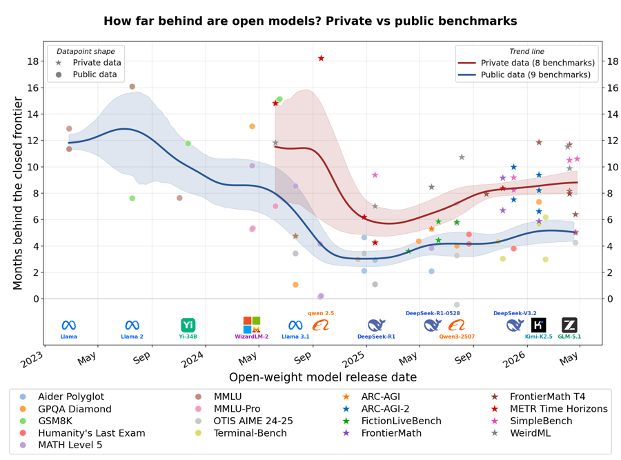

# Blog

I write about AI capabilities, benchmarks, and research on [LessWrong](https://www.lesswrong.com/).

  <a href="https://www.lesswrong.com/posts/rJcCrXyEsJKmmDpWG/how-far-behind-are-open-models" class="blog-card">
    
    

      How far behind are open models?
      Measuring the gap between open-weights and closed models across 17 benchmarks using data from the Epoch AI Benchmarking Hub. On private, contamination-resistant benchmarks open models are roughly 8&ndash;10 months behind the closed frontier, while on public benchmarks the gap is roughly 4&ndash;6 months&mdash;and the gap has been growing since DeepSeek R1.
    

  </a>
  <a href="https://www.lesswrong.com/posts/JzfcJMgfkhfRhwg4C/a-benchmark-is-a-sensor" class="blog-card">
    
    

      A benchmark is a sensor
      With Mathias Bynke. An AI capability benchmark is like a sensor with a certain sensitivity within a certain range of capabilities: it cannot distinguish models when all tasks are too hard or too easy, but has peak sensitivity in a middle range where small capability differences show up clearly in the score.
    

  </a>
  <a href="https://www.lesswrong.com/posts/hoQd3rE7WEaduBmMT/weirdml-time-horizons" class="blog-card">
    
    

      WeirdML Time Horizons
      Applying METR's time horizons approach to WeirdML data. Time horizons roughly double every 5 months, from ~24 minutes (GPT-4, June 2023) to ~38 hours (Claude Opus 4.6, February 2026), consistent with METR's finding of ~7 months despite using a completely different benchmark.
    

  </a>
  <a href="https://www.lesswrong.com/posts/fpdjaF7kdtcvmhhfE/can-llms-coordinate-a-simple-schelling-point-experiment" class="blog-card">
    
    

      Can LLMs Coordinate? A Simple Schelling Point Experiment
      Testing whether five advanced AI models can coordinate on matching answers to 75 prompts without communication. Models excelled on concrete prompts like "a number between 1 and 10" (achieving perfect agreement on "7") but struggled with more abstract requests.
    

  </a>
  <a href="https://www.lesswrong.com/posts/ifSBamvobbyB9KWjK/inference-costs-for-hard-coding-tasks-halve-roughly-every" class="blog-card">
    
    

      Inference costs for hard coding tasks halve roughly every two months
      Analysis of declining AI inference costs using WeirdML and Aider Polyglot benchmark data. The research shows that the cost to achieve a certain score halves roughly every two months—tasks that once cost dollars with GPT-4 can now be completed for fractions of a cent.
    

  </a>
  <a href="https://www.lesswrong.com/posts/NLnGRDRXATW2pqXuE/is-the-gap-between-open-and-closed-models-growing-evidence" class="blog-card">
    
    

      Is the gap between open and closed models growing? Evidence from WeirdML
      Analysis from the WeirdML benchmark showing that the gap between open and closed models is not shrinking over time. Closed-source models like OpenAI's o1 and o3 maintain a substantial lead over open-weights alternatives even months after their release.
    

  </a>
  <a href="https://www.lesswrong.com/posts/LfQCzph7rc2vxpweS/introducing-the-weirdml-benchmark" class="blog-card">
    
    

      Introducing the WeirdML Benchmark
      Introducing a benchmark that evaluates how well LLMs perform machine learning on novel datasets. Tests the ability to understand data properties, generate working PyTorch code, and improve solutions through iterative feedback over five rounds.
    

  </a>
  <a href="https://www.lesswrong.com/posts/vLB4tkLWYmQrJstCA/o1-preview-is-pretty-good-at-doing-ml-on-an-unknown-dataset" class="blog-card">
    
    

      o1-preview is pretty good at doing ML on an unknown dataset
      Evaluating OpenAI's o1-preview on a shape classification challenge from 2D point data. The model achieved 77% accuracy on its fourth submission, significantly outperforming GPT-4o and Claude, showing a major advancement in handling complex, unfamiliar tasks.
    

  </a>
  <a href="https://www.lesswrong.com/posts/Fr6eJkjYWG9Mw6XQc/how-good-are-llms-at-doing-ml-on-an-unknown-dataset" class="blog-card">
    
    

      How good are LLMs at doing ML on an unknown dataset?
      The original exploration that led to WeirdML. Challenged GPT-4o, Claude Sonnet 3.5, and Gemini to develop classifiers for geometric shapes from 2D point clouds. Found unreliable performance and fundamental gaps in ML reasoning capabilities.
    

  </a>

