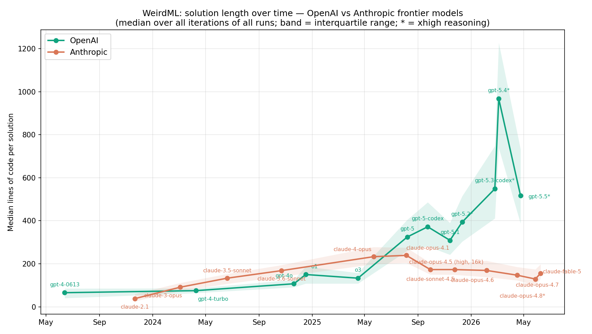
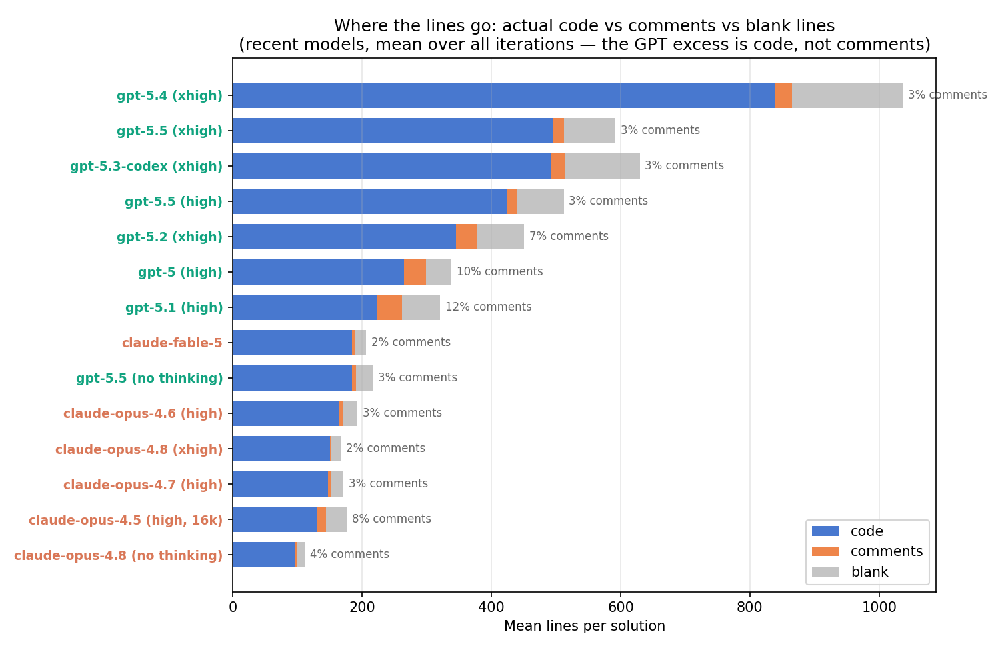
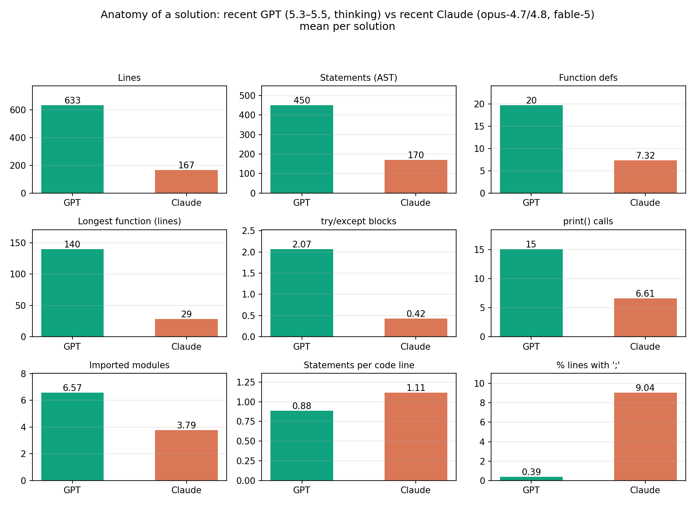
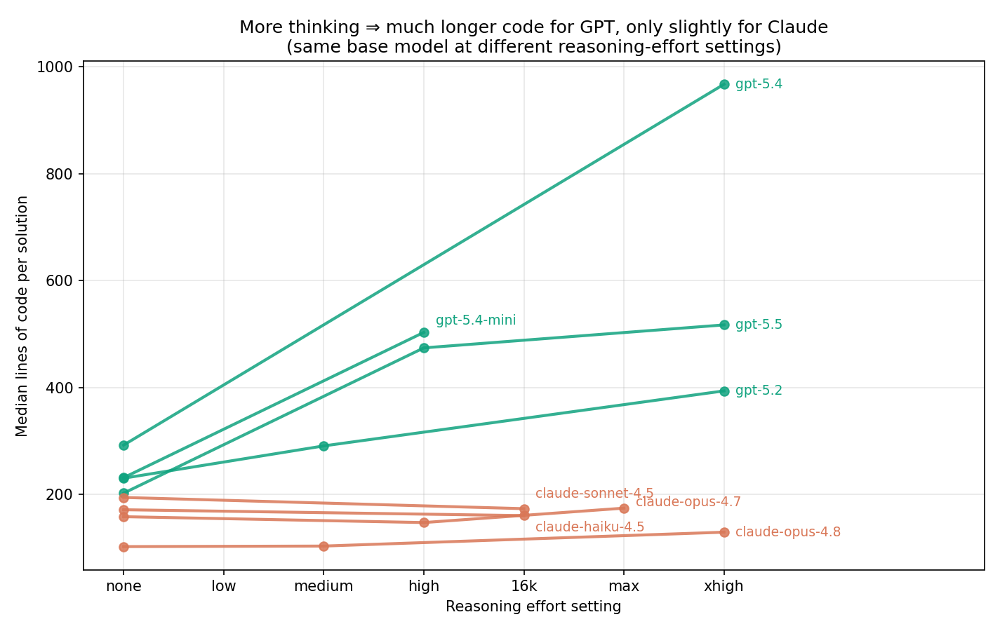
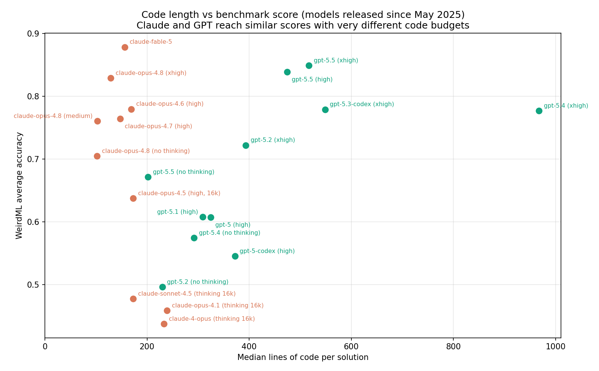

# Why does GPT write 5x more code than Claude? by Fable

  An analysis of code length on WeirdML — June 2026. Back to the main <a href="weirdml.html">WeirdML</a> page.

A question that comes up regularly when people look at the WeirdML data: recent GPT models write dramatically longer solutions than recent Claude models. Is GPT just adding a lot of comments? Is it doing more feature engineering? Is Claude getting lazy? I dug into the ~30,000 Python programs the models have written for the benchmark to find out.

**The short answer:** the gap is real code, not comments. Recent GPT models (since GPT-5) build *portfolio systems* — they train many candidate models, write explicit machinery to select and blend among them, and wrap everything in defensive fallbacks and diagnostic logging. Recent Claude models commit to a single well-chosen method and write it in an extremely dense style. The two philosophies reach similar benchmark scores with a ~4x difference in code volume.

## When did this start?

The framing "Claude has become less verbose" turns out to be backwards. Until mid-2025, Claude consistently wrote *longer* code than GPT. The divergence starts precisely with GPT-5 in August 2025: every subsequent GPT release writes more code than the last, peaking with gpt-5.4 at a median of **968 lines** per solution, while Anthropic's median has slowly *declined* from claude-opus-4.1 (~240 lines) to claude-opus-4.8 (~130 lines at xhigh reasoning).

  
  
<strong>Figure 1.</strong> Solution length over time for OpenAI and Anthropic frontier models.

The gap is not driven by a few outlier tasks: comparing gpt-5.4 against claude-opus-4.8 (xhigh) task by task, the median-length ratio ranges from 3x (blunders_hard) to 12x (number_patterns) — GPT writes much more code on *every* task.

## It's not comments

The most common guess — "it's probably the same code with lots of comments" — is the easiest to rule out. I classified every line of every solution as code, comment/docstring, or blank:

  
  
<strong>Figure 2.</strong> Decomposition of solution lines into code, comments, and blanks.

Recent frontier models from both labs barely comment at all: gpt-5.4 is 2.6% comments (one of its 1,162-line solutions contains literally zero comment lines), claude-opus-4.8 is 1.7%. Interestingly, commenting has *collapsed* in both families: gpt-5 and gpt-5.1 commented 10–12% of lines, o3 15%, claude-4-opus 13%. The newest models seem to have had this trained out of them. Either way: the GPT excess is almost entirely actual code.

## What is all that code doing?

Automated metrics give a first hint. Comparing recent GPT (gpt-5.3-codex/5.4/5.5 with thinking) to recent Claude (opus-4.7/4.8, fable-5), per solution:

  
  
<strong>Figure 3.</strong> Structural anatomy of GPT vs. Claude solutions.

GPT writes ~20 functions to Claude's ~7, imports nearly twice as many libraries, uses **5x as many try/except blocks**, prints twice as much, and — most tellingly — its longest function averages 140 lines versus Claude's 29. The bottom row shows the formatting side: Claude packs 1.11 statements per code line (9% of its lines contain semicolons, e.g. `opt.zero_grad(); loss.backward(); opt.step()`), while GPT writes airy, one-statement-per-line code. Counting AST statements instead of lines shrinks the gap from 3.8x to 2.6x — so roughly **1.4x of the gap is formatting density, and the remaining ~2.6x is genuinely more program**.

To see what that program *is*, I read (with some help from Claude code-reading agents) matched final-iteration solutions from both families across five tasks. The pattern is remarkably consistent.

**GPT's house style: "portfolio + selector".** A typical recent GPT solution trains several candidate models over several engineered feature views, generates dozens of candidate prediction sets, and then builds explicit selection machinery on top: 5-fold out-of-fold evaluation harnesses, grid searches over blend weights (one gpt-5.4 solution searches ~432 fusion configurations on a validation split; another builds ~40 base models and runs greedy/pairwise/triple ensemble search over them), confidence-gated model switching, and class-balance post-processing via Hungarian assignment. Each risky stage is wrapped defensively: one gpt-5.4 chess solution contains **25 try/except blocks**, each fitted model guarded by a `have_*` flag with a fallback path, predictions saved in stages (dummy → interim → final). Add 15–60 diagnostic print statements, and a fair amount of genuine copy-paste (parallel "full" and "simple backup" pipelines that are near-duplicates of each other — roughly 15% of the longest files).

**Claude's house style: "one good recipe, executed densely".** Claude picks a single method — often a genuinely sophisticated one (SHOT domain adaptation implemented in 13 lines, a generative EM mixture model, FixMatch with prior debiasing, static-exchange-evaluation chess features) — writes it with multiple statements per line, ensembles over a few seeds, and prints almost nothing. Its solutions contain essentially no defensive scaffolding: the typical Claude file has zero or one try/except, usually a single top-level one that writes fallback predictions if anything crashes. Claude also uses the five feedback iterations differently: one opus-4.7 run spent its entire final iteration on a parser-debugging script that outputs *no predictions at all*, relying on the benchmark's max-over-iterations scoring to keep an earlier score — treating iterations as an experiment budget, where GPT treats every iteration as a complete, shippable deliverable (and its solutions grow ~40% from iteration 1 to 5, versus ~20% for Claude).

## The driver: reasoning effort

The cleanest causal evidence comes from running the same base model at different reasoning-effort settings:

  
  
<strong>Figure 4.</strong> Code length vs. reasoning-effort setting.

**GPT with thinking disabled writes Claude-length code.** gpt-5.5 goes from 202 median lines (no thinking) to 474 (high) to 517 (xhigh); gpt-5.4 goes from 292 to 968. Claude's length is essentially flat across thinking settings — opus-4.8 moves from 102 to just 129 lines between no-thinking and xhigh. Whatever GPT works out during its long deliberation, it apparently *ships*: more thinking turns into more candidate models, more selection machinery, more guards. Claude thinks longer but still distills the result into the same compact program.

## Does the extra code pay off?

  
  
<strong>Figure 5.</strong> Code length vs. WeirdML score.

Both strategies reach the frontier. claude-fable-5 has the highest score on the benchmark (0.878) at a median of 156 lines; gpt-5.5 (xhigh) reaches 0.849 with solutions three times as long. Within the GPT line, more code has generally meant more score — with the notable exception of gpt-5.4, which wrote by far the most code of any model ever (median 968 lines) for a mid-pack 0.776. Reading its solutions, you can see why: its shapes_easy entry hardcodes ~40 blend weights and confidence thresholds with *no validation anywhere in the file*. The portfolio strategy clearly hit diminishing returns there, and gpt-5.5 pulled back to roughly half the length.

So: GPT and Claude aren't writing the same solution at different verbosity. They embody two different engineering philosophies — *enumerate and select* versus *commit and execute* — and the code length difference is mostly a faithful reflection of that, with a smaller (~1.4x) contribution from Claude's unusually dense formatting style.

---

*Methodology: all 30,083 code submissions from valid runs of GPT/o-series and Claude models were analyzed with per-line classification (tokenize) and AST-based structural metrics. Length figures are medians over all iterations of all runs. Qualitative findings are from reading matched final-iteration solutions on shapes_easy, classify_shuffled, digits_generalize, chess_winners, and xor_hard for gpt-5.2–5.5, gpt-5.3-codex, claude-opus-4.7/4.8, and claude-fable-5.*
