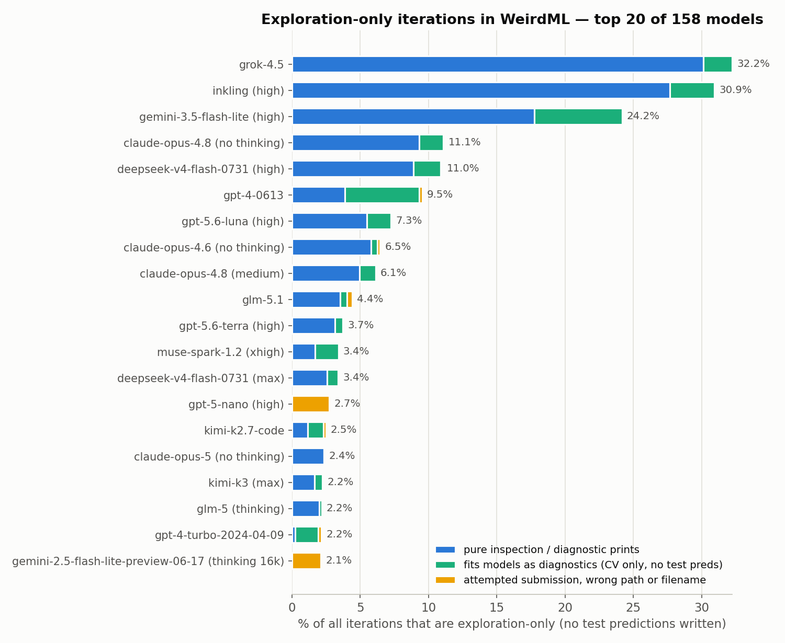
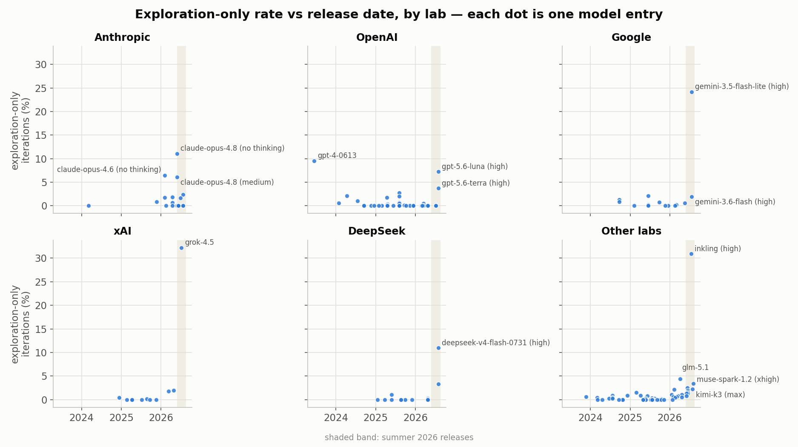
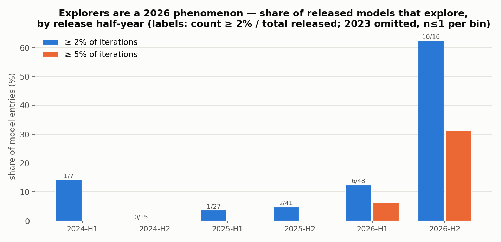
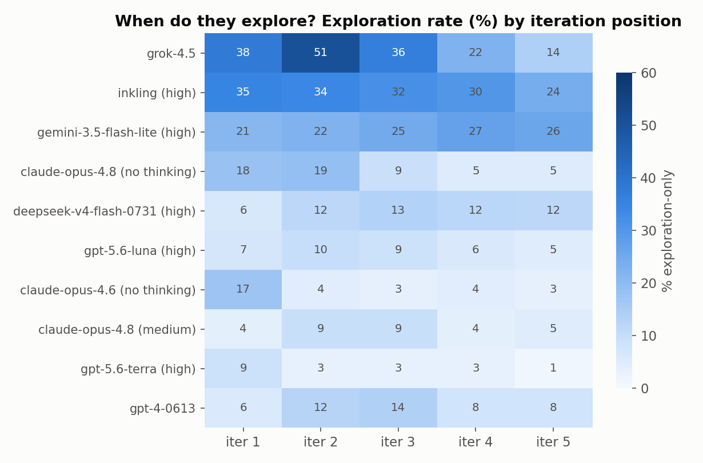
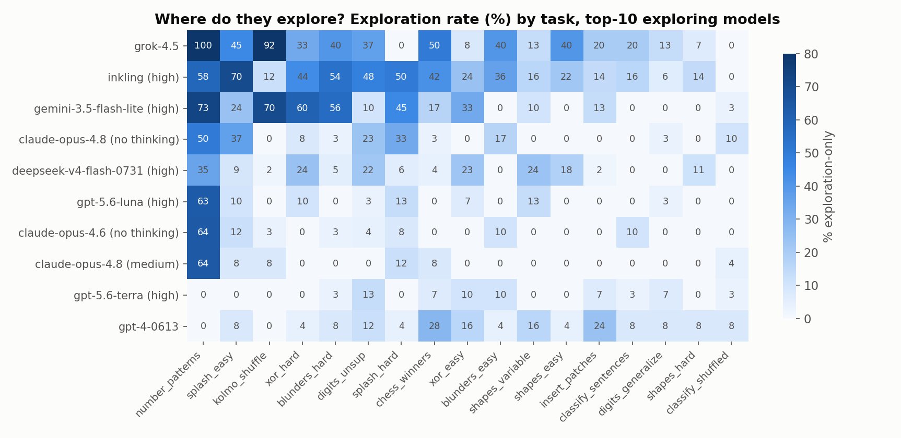
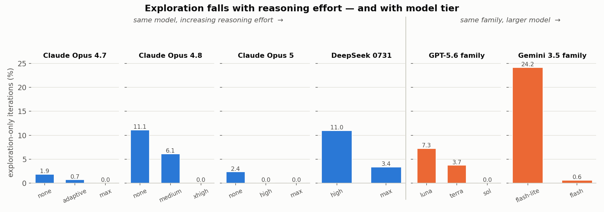
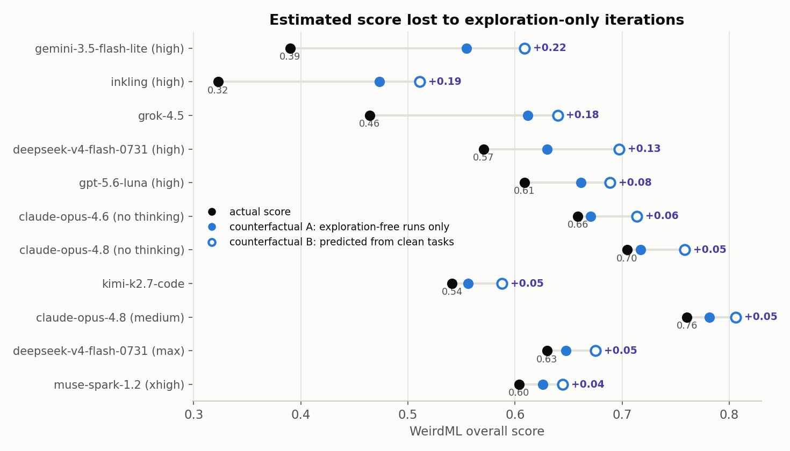
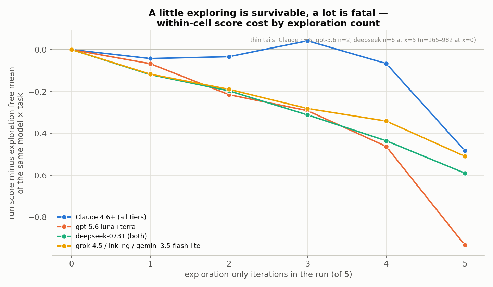

# Exploring instead of scoring

  Back to the main <a href="weirdml.html">WeirdML</a> page.

## Introduction

In the regular WeirdML setup a model submits a single script per iteration,
the script is executed once in a sandbox, and whatever it writes to
`results/test_preds.txt` is scored against hidden test labels. Each run has
five iterations, and the run's score is the best of the five. An
**exploration-only iteration** is one where the submitted code runs fine and
prints data inspection output — shapes, class statistics, sample dumps —
but never writes a predictions file at all, scoring an automatic 0.0.

This behavior was first noticed in Claude models, and has been showing up in
more and more models lately. This page extends the analysis to all 158 model
configurations in the benchmark (16,915 valid runs / 84,550 iterations),
classifies all 1,338 exploration-only iterations from their code and
conversation logs, and includes an LLM-assisted audit that read 83 sampled
runs end-to-end across seven model families.

## Summary

- **The behavior is real, deliberate, and new.** The transcript audit
  confirms these are almost never "forgot the save line": in 78 of 83
  audited samples the script contains *no test-prediction computation at
  all* — the model consciously spent the turn probing.
- **It exploded in summer 2026.** Among model entries released 2024–2025,
  2–5% show a ≥2% exploration rate. Of 2026-H2 releases, **10 of 16** do.
  The top offenders are all July-2026 releases: grok-4.5 (32.2%),
  inkling (30.9%), gemini-3.5-flash-lite (24.2%), deepseek-v4-flash-0731
  (11.0%), gpt-5.6-luna (7.3%). The Claude models where this was first
  noticed sit lower (claude-opus-4.8 (no thinking) 11.1%, (medium) 6.1%,
  claude-opus-4.6 6.5%).
- **It is not one phenomenon, and they are not all Claude clones.** The
  transcripts show at least four distinct mechanisms — Claude's announced
  explore-first habit, a notebook/REPL delusion (grok-4.5, inkling,
  gemini-3.5-flash-lite), DeepSeek's explore-when-stuck rabbit-holing, and
  a silent train/val "researcher mode" (muse-spark, grok-4.20-beta). Style
  fingerprints differ sharply between labs; only GLM and Kimi reproduce
  Claude's canonical phrasing near-verbatim.
- **Two things protect against it: reasoning effort, and model tier.** On
  the same weights, more effort means fewer wasted submissions
  (claude-opus-4.8: 11.1% → 6.1% → 0.0% going no-thinking → medium →
  xhigh). And within a family, the smaller sibling model explores far more
  (gemini-3.5-flash-lite 24.2% vs gemini-3.5-flash 0.6%; gpt-5.6-luna 7.3%
  / terra 3.7% / sol 0.0%).
- **Conservative score impact:** grok-4.5 loses an estimated **0.15–0.18**
  in overall score, inkling 0.15–0.19, gemini-3.5-flash-lite 0.17–0.22,
  deepseek-v4-flash-0731 0.06–0.13, gpt-5.6-luna 0.05–0.08; the Claude 4.8
  variants 0.01–0.05. Benchmark-wide, **53 runs spent all five iterations
  exploring and scored 0.000** — several on tasks the model had
  demonstrably solved.
- **The harness's silence is a contributing cause.** The system prompt says
  only "you have several iterations" — never the number five — and the 0.0
  feedback line never says the attempt was forfeited. Models with an
  agentic prior read the loop as an unbounded tool-call session, and almost
  none ever verbally acknowledge the `Results file not found` feedback.

## What counts, and how it was measured

An iteration is counted as exploration-only if the harness note says
`Results file not found` (the code exited cleanly but wrote no predictions
file), stdout is non-empty (the code actually ran and printed something),
and it was not a sandbox timeout. This excludes crashes, timeouts, and
empty submissions — what remains is a turn the model spent running code
whose only output was information.

Two refinements, prompted by the transcript audit:

- **Filename hallucination is not exploration.** gpt-5-nano writes complete
  solutions to invented paths (e.g. `results/blunder_preds.txt`, or
  `test_preds.txt` in the working directory). Every audited gpt-5-nano
  "exploration" iteration was actually a failed submission. These are
  separated out (yellow in Figure 1) and excluded from the
  deliberate-exploration story.
- **Old-model cases are a different beast.** gpt-4's 9.5% (2023) is staged
  development — "We will not train the model yet" — plus crash-debugging,
  with no concept of an iteration budget. Genuine inspect-the-data-first
  behavior is essentially absent before 2026.

Every flagged iteration was then classified from its extracted code file
and conversation log (announcement language, training code, save attempts),
and 83 of them — covering 25 models in 7 family groups — were read
end-to-end in context, including the surrounding iterations of each run.
The audit found the automated classes are directionally right and the
headline split holds: **deliberate probing, not accidental omission,
dominates everywhere except gpt-5-nano and pre-2025 OpenAI models.**

## Who does it

  
  
<strong>Figure 1.</strong> Top 20 of 158 model entries by exploration-only rate. Blue: pure inspection/diagnostic prints. Green: fits models but only as diagnostics (cross-validation scores printed, test set never touched — the audit found virtually none of these are "forgot to save"). Yellow: attempted a submission but wrote a wrong path/filename (gpt-5-nano, gemini-2.5-flash-lite) — a mechanical failure, not exploration.

Three models are in a league of their own — grok-4.5, inkling, and
gemini-3.5-flash-lite, all released within a 13-day window in July 2026. A
second tier around 6–11% contains claude-opus-4.8 (no thinking and medium),
deepseek-v4-flash-0731, gpt-5.6-luna, and claude-opus-4.6. The long tail of
1–4% models spans every major lab: GLM, Kimi, Muse, Nemotron,
gemini-3.6-flash, grok-4.20-beta.

The rate understates the tail risk. Exploration clusters within runs:
grok-4.5 has at least one exploration iteration in **67%** of its runs,
inkling in 50%, gemini-3.5-flash-lite in 45% — and 53 runs benchmark-wide
burned all five iterations this way, which scores exactly 0.000 regardless
of how good the analysis was.

## Timeline: a 2026 phenomenon

  
  
<strong>Figure 2.</strong> Exploration rate vs. release date, by lab. Every panel shows the same shape: near-zero through 2024–2025, first stirrings in early 2026 (claude-opus-4.6, February), then a spike in the summer-2026 release wave (shaded). The lone pre-2026 outlier, gpt-4-0613 (9.5%), is staged development and non-compliance, not data exploration.

  
  
<strong>Figure 3.</strong> Share of released model entries that explore, by release half-year. Under 5% of 2025 releases cross the 2% line; 12.5% of 2026-H1 releases do; <strong>62.5%</strong> (10/16) of 2026-H2 releases do, and 5/16 cross 5%. The impression that "more and more models do this lately" is quantitatively exact.

The chronology within families is telling. Anthropic first: claude-opus-4.6
(February 2026) is the earliest model with a meaningful rate. xAI, Google,
Thinking Machines, DeepSeek and OpenAI all ship their first exploring
models in a five-week window (July 8 – August 5, 2026) — and in each case
the predecessor model, often only weeks older, shows nothing (grok-4.3:
1.9%; gemini-3.5-flash: 0.6%; deepseek-v4-flash (April): 0.3%; gpt-5.5:
0.0%). Whatever changed, it changed in everyone's post-training at roughly
the same time.

## What is actually going on: four mechanisms

Reading the transcripts breaks the single metric into four distinct
behaviors. They share a root — the model treats a scored submission as a
free tool call, much as if it were in the
[Agentic WeirdML](agentic_weirdml.html) setting where exploration between
submissions really is free — but they differ in almost everything else.

### A · Announced explore-first — Claude Opus 4.6–4.8, opus-5 (no thinking), Kimi, GLM, gpt-5.6-terra

Front-loaded and narrated. Iteration 1 opens with the canonical "I'll start
by exploring the data to understand …", prints shapes and class statistics,
then iteration 2 submits. Exploration rate collapses across iterations
(claude-opus-4.6: 17% at iteration 1 → 3% by iteration 5). This usually
pays for itself: Claude runs with 1–3 exploration iterations score about as
well as exploration-free runs of the same model × task, and several
near-ceiling runs (0.93–0.997) trace directly to the probe. The
catastrophic tail is unbounded curiosity: five Claude runs explored all
five iterations — every one on number_patterns — including one holding a
97.5%-CV solution it never submitted.

### B · Notebook / REPL delusion — grok-4.5, inkling, gemini-3.5-flash-lite

The model does not believe it is submitting. Exploration is flat or rising
across all five iterations; the 0.0 feedback is never acknowledged
(grok-4.5: zero mentions of the predictions file in 425 turns of prose; 46
of 103 first iterations `import matplotlib` against explicit instructions).
inkling leaks literal serialized tool calls
(`bash{"name":"bash","args":{…}}`) into its answers; gemini-3.5-flash-lite
emits bare unnarrated code cells (69% of its turns contain zero prose) and
thinks in code comments ("*# Wait! Let's check …*"). These three models pay
the largest score penalties on the benchmark (−0.15 to −0.22).

### C · Explore-when-stuck — deepseek-v4-flash-0731, gemini-3.6-flash, Nemotron

Triggered by a bad score, not by task onset. deepseek-0731's rate is lowest
at iteration 1 (6%) and flat after (12–13%): when a submission disappoints,
it goes down a forensic rabbit hole — and knows the cost. Its reasoning
says things like *"no result file so metric zero but okay. We'll inspect."*
It repeatedly writes "need ensure final code writes predictions" in its
reasoning and then emits a print-only script anyway. gemini-3.6-flash
explores *after* success, burning iterations 4–5 probing the data's
generative rule out of pure curiosity when it had already banked 0.993.

### D · Silent researcher mode — muse-spark-1.2, grok-4.20-beta

Zero prose, and exploration means train/val experiments, not data peeking.
muse-spark ran five consecutive model-selection bake-offs (BiLSTM vs
ExtraTrees vs MLP, confusion matrices) against a validation split; the test
set was loaded once, in iteration 1, and never touched again. The run
scored 0.000. This is an offline ML-researcher workflow with no concept of
"submission" at all — structurally the same misread as mechanism B, but
expressed as experimentation rather than inspection.

  
  
<strong>Figure 4.</strong> When they explore separates the mechanisms. Front-loaded rows (claude-opus-4.6: 17→3; gpt-5.6-terra: 9→1) are strategy. Flat or rising rows (inkling 35→24, gemini-3.5-flash-lite 21→<em>26</em>, deepseek 6→12) are models that never register the cost. grok-4.5 peaks mid-run at 51% — it ramps up submissions only in late iterations, having spent the early ones "in the notebook".

### The transcripts in their own words

> "I'll start by exploring the data to understand the distribution of numbers per class. […] Let me see the output before building a model."
>
> — claude-opus-4.8 (no thinking), number_patterns, iteration 1

> "My first submission will be exploratory — printing detailed per-class statistics so I can understand the structure. **I'll output a simple baseline prediction too.**"
>
> — claude-opus-4.8 (xhigh), number_patterns, iteration 1 — the hedge that makes high-effort variants immune: same urge, plus a baseline save

> "I'll start by exploring the data to understand the problem better."
>
> — grok-4.5, iteration 1 — this near-verbatim opener template appears in ~45 of its 103 first turns

> "Let's run mental? No, need actual execution feedback. Let's submit.`bash{"name":"bash","args":{"code":"import json, numpy as np…"}}`"
>
> — inkling, iteration 1 — a literal serialized tool call leaking into the answer channel

> "But need eventually save predictions. Let's do exploration first."
>
> — inkling, reasoning at iteration 5 of 5 — the phrase "need save predictions" appears 406 times across its 170 runs; it deferred every time

> "We should use time for exploration but eventually produce. Let's do analysis now, output useful stats, maybe no results to avoid wasting? It will error metric but okay. We need learn."
>
> — deepseek-v4-flash-0731 (max), reasoning at iteration 5 — fully aware of the 0.0, wrong about having time

> "go"
>
> — gemini-3.5-flash-lite — the <em>entire</em> natural-language content of an assistant turn, followed by a bare code cell; 69% of its turns contain zero prose, and its scripts often end mid-thought on a "<code># Wait, let's check…</code>" comment (all 28 such comment-ending scripts lack a save)

> "I need to *see* the data. Let me run a fast diagnostic that prints ASCII renderings […] plus coordinate statistics."
>
> — kimi-k3 (max), xor_hard, iteration 3 — ASCII art as the universal workaround for a plot-less sandbox, reinvented independently by at least five labs

Two recurring details deserve emphasis. First, **the models that explore
most acknowledge the feedback least**: sweeps over full conversation
corpora found essentially zero prose reactions to `Accuracy: 0.0, Results
file not found` from grok-4.5, inkling, gemini-3.5-flash-lite, or any of
the 1–4% tail labs — the line is parsed when it carries a positive number
("0.54 is a start") and treated as null otherwise. Second, **the harness
never states the budget**: the system prompt says "several iterations", so
a model with an agentic prior can rationally believe the loop is long;
nothing it reads ever corrects it, and "since we have time left" (grok-4.5)
and "We have many iterations" (deepseek) show that belief out loud.

## Which tasks bait it

  
  
<strong>Figure 5.</strong> Exploration rate by task, top-10 exploring models. Tasks with hidden generative structure dominate: number_patterns baits everyone — grok-4.5 explored on <em>100%</em> of its iterations there, and claude-opus-4.6/4.8 hit 64% — followed by kolmo_shuffle, the splash tasks, and xor_hard. Tasks that read as straightforward supervised learning barely trigger it.

This is the cleanest evidence that the behavior is a reasoning disposition
rather than a formatting bug: it concentrates precisely on tasks where
"figure out the generative rule" feels more productive than "train a
classifier". All five Claude total-wipeout runs are on number_patterns;
grok-4.5 and gemini-3.5-flash-lite each posted task means of exactly 0.000
on tasks their predecessors scored 0.4–0.7 on.

## What protects: reasoning effort and model tier

  
  
<strong>Figure 6.</strong> Two separate dose-response patterns. Left (blue): the <em>same model weights</em> at increasing reasoning effort — claude-opus-4.8: 11.1 → 6.1 → 0.0 (none → medium → xhigh); claude-opus-5: 2.4 → 0 → 0; deepseek-0731: 11.0 → 3.4 (high → max). Right (orange): <em>different sibling models</em> within a family, ordered small → large — gpt-5.6: luna 7.3 / terra 3.7 / sol 0.0; gemini-3.5: flash-lite 24.2 / flash 0.6. Both point the same way: the disposition surfaces when there is less compute — whether per-token reasoning or model capacity — between the impulse and the submission.

The transcript audit pinned down the mechanism for Claude, and it is not
"thinking absorbs the exploration". Counting iterations whose *prose
announces* exploration: claude-opus-4.8 (xhigh) announces slightly **more**
often than (medium) (11.8% vs 10.0%) — but in 100% of xhigh's
announced-exploration iterations the code *still writes* the predictions
file (a cheap baseline bolted onto the diagnostic), versus 67% for
no-thinking. The exploratory impulse is identical across effort tiers;
extended thinking supplies the hedge — the model reasons far enough ahead
to remember the turn is scored. The no-thinking transcripts show how
fragile the hedge is: when it is verbalized ("…while also saving a
prediction file") it is executed and the iteration scores; the next
iteration drops the clause and scores 0.0.

Generation gates the whole effect: low effort is not sufficient. Every
pre-4.6 Claude at every tier is ≈0%, and claude-fable-5 is 0.0% across all
its entries — whatever entered post-training between opus-4.5 and
opus-4.6, and left again by fable-5 / opus-5 (high), is the actual
variable. The same generational signature shows across labs: grok-4.3 →
4.5 and deepseek April → July are the same family weeks apart with 15–35×
rate jumps.

## What it costs: conservative estimates

Two counterfactuals per model, canonical 17 tasks only:

- **A — within-cell (most conservative):** replace each task's score with
  the mean over that same model × task's *exploration-free runs*. Uses only
  the model's own results; where a cell has no clean runs (e.g. grok-4.5 on
  number_patterns, 0 of 5), falls back to B's prediction for that cell.
- **B — ability model:** estimate the model's ability from tasks where it
  explored &lt;5% of iterations, using a k-nearest-neighbors mapping (k=12)
  over the 118 reference models with &lt;1% exploration; predict the
  affected tasks from that ability, never predicting below what was
  actually achieved.

Method A is conservative because exploring and non-exploring runs of the
same cell share any genuine task weakness; B asks "what would a normal
model of this clean-task ability score here". Reality is likely between
them.

  
  
<strong>Figure 7.</strong> Actual score (black) vs. counterfactual A (filled blue) and B (open blue). For the notebook-mode trio the effect is leaderboard-shattering: grok-4.5's 0.46 would be ~0.61–0.64 — comfortably above grok-4.3's 0.499, consistent with the observation that where it plays the game it is clearly the stronger model. For Claude variants the effect is real but modest (+0.01–0.05).

<table>
<thead><tr><th>model</th><th>expl. rate</th><th>actual</th><th>cf. A (within-cell)</th><th>cf. B (ability model)</th><th>est. loss</th></tr></thead>
<tbody>
<tr><td>gemini-3.5-flash-lite</td><td>24.2%</td><td>0.390</td><td>0.555</td><td>0.609</td><td><strong>0.17–0.22</strong></td></tr>
<tr><td>inkling</td><td>30.9%</td><td>0.323</td><td>0.473</td><td>0.511</td><td><strong>0.15–0.19</strong></td></tr>
<tr><td>grok-4.5</td><td>32.2%</td><td>0.464</td><td>0.612</td><td>0.640</td><td><strong>0.15–0.18</strong></td></tr>
<tr><td>deepseek-v4-flash-0731 (high)</td><td>11.0%</td><td>0.571</td><td>0.630</td><td>0.697</td><td><strong>0.06–0.13</strong></td></tr>
<tr><td>gpt-5.6-luna</td><td>7.3%</td><td>0.609</td><td>0.661</td><td>0.689</td><td><strong>0.05–0.08</strong></td></tr>
<tr><td>claude-opus-4.6 (no thinking)</td><td>6.5%</td><td>0.659</td><td>0.671</td><td>0.714</td><td><strong>0.01–0.06</strong></td></tr>
<tr><td>claude-opus-4.8 (no thinking)</td><td>11.1%</td><td>0.705</td><td>0.717</td><td>0.758</td><td><strong>0.01–0.05</strong></td></tr>
<tr><td>claude-opus-4.8 (medium)</td><td>6.1%</td><td>0.760</td><td>0.782</td><td>0.806</td><td><strong>0.02–0.05</strong></td></tr>
<tr><td>kimi-k2.7-code</td><td>2.5%</td><td>0.541</td><td>0.556</td><td>0.588</td><td><strong>0.02–0.05</strong></td></tr>
<tr><td>deepseek-v4-flash-0731 (max)</td><td>3.4%</td><td>0.630</td><td>0.647</td><td>0.675</td><td><strong>0.02–0.05</strong></td></tr>
<tr><td>muse-spark-1.2 (xhigh)</td><td>3.4%</td><td>0.604</td><td>0.626</td><td>0.644</td><td><strong>0.02–0.04</strong></td></tr>
<tr><td>gpt-5.6-terra</td><td>3.7%</td><td>0.783</td><td>0.790</td><td>0.793</td><td><strong>0.01</strong></td></tr>
</tbody>
</table>

  
  
<strong>Figure 8.</strong> Within-cell cost by exploration count. For Claude 4.6+, 1–3 exploration iterations are roughly cost-neutral (the probe pays for the lost attempt) and only the unbounded case is catastrophic. For gpt-5.6, deepseek-0731 and the notebook-mode trio, cost is monotone from the first wasted iteration — their exploration doesn't convert. At 5/5 everyone is at or near total loss. Thin tails: n=1–6 for some right-side points.

The starkest single number: the audit found multiple runs that *solved
their task and shipped nothing*. inkling reached 98.5% cross-validated
accuracy on shapes_easy at iteration 4, spent iteration 5 comparing tree
counts, and scored 0.000. claude-opus-4.8 (medium) held a 97.5%-CV
number_patterns model at iteration 3 and spent the last two turns on a
side-investigation instead of submitting it. Exploration failure is not a
capability failure — which is exactly why the counterfactual gaps above
are so large.

## Are they all distilled from Claude?

No — the fingerprints argue for convergent evolution with pockets of
direct imitation.

<table>
<thead><tr><th>family</th><th>announces?</th><th>signature register</th><th>Claude-resemblance verdict</th></tr></thead>
<tbody>
<tr><td><strong>Claude 4.6–4.8</strong> (reference)</td><td>always</td><td>"I'll start by exploring the data to understand ⟨X⟩ … before building a model"; shapes/class-stats checklist</td><td>—</td></tr>
<tr><td><strong>GLM / Kimi</strong></td><td>always</td><td>glm-5: <em>"Let me start by exploring the data to understand what we're dealing with"</em> — verbatim canonical phrasing; kimi: markdown headers, numbered plans with "<strong>Explore</strong>" as step 1</td><td><strong>Closest to direct imitation</strong> — consistent with training on Claude-style agentic transcripts</td></tr>
<tr><td><strong>grok-4.5</strong></td><td>always, tersely</td><td>Rigid 2-sentence template, ~45/103 first turns near-identical; zero budget vocabulary, zero fallback submissions, wants plots/checkpoints/multi-cell</td><td>Opener resembles Claude; everything else (no hedging, no recaps, notebook affordances) does not</td></tr>
<tr><td><strong>deepseek-0731</strong></td><td>sometimes</td><td>Visible channel: polished Claude-like openers. Reasoning channel, same turn: native telegraphic register ("We need solve task. Need build model")</td><td><strong>Claude veneer over native policy</strong> — surface-level polish, behavior is its own (stuck-triggered, not front-loaded)</td></tr>
<tr><td><strong>gpt-5.6</strong></td><td>terra yes, luna no</td><td>terra: "I'll first inspect ⟨quantities⟩" + a domain hypothesis, never "explore"; luna: bare code, ASCII-art idiom, intent only in hidden reasoning</td><td>Convergent, independently derived; lexically distinct</td></tr>
<tr><td><strong>gemini-3.5-flash-lite</strong></td><td>almost never</td><td>69% zero-prose turns; impersonal captions ("An exploratory script to…"); thinks in code comments ("# Wait! …"); degenerate one-token turns ("go")</td><td><strong>Opposite pole</strong> — looks like notebook/REPL-cell training data, not assistant transcripts</td></tr>
<tr><td><strong>inkling</strong></td><td>almost never</td><td>0-char prose on 63% of exploration turns; leaked <code>bash{…}</code> tool calls, stray <code>&lt;/thinking&gt;</code> tags; "Need run. Let's do."</td><td>Not Claude-derived; raw agent-loop training leaking. Claude-like register appears <em>only</em> on its rare high-reasoning turns</td></tr>
<tr><td><strong>muse-spark / grok-4.20</strong></td><td>never</td><td>Zero words in entire runs; exploration = train/val experiment harnesses, not data peeking</td><td>Not Claude-like at all</td></tr>
</tbody>
</table>

The better unifying story: every lab moved to agentic/tool-loop
post-training in the same six months, and models carried the *orient →
inspect → experiment → then act* loop into a harness where each act is a
scored, finite submission. Where that training was assistant-flavored
(Anthropic, Moonshot, Z-ai) the behavior arrives narrated and
front-loaded; where it was notebook- or raw-loop-flavored (Google's lite
tier, Thinking Machines, xAI) it arrives silent and unbounded. The
strongest models of the same generation (fable-5, opus-5 (high),
gpt-5.6-sol, kimi-k3 at 2%) either hedge every probe with a baseline save
or do the exploration inside their reasoning channel — which is why the
leaderboard's top is clean while the mid-field bleeds.

## Caveats

- **The heuristic has edges.** It misses exploration hidden inside
  submitting iterations (a probe plus a hedge save counts as clean — which
  is precisely why xhigh tiers measure 0%), and it originally over-counted
  filename hallucination (now separated). True "deliberate probing" rates
  for hedging models are higher than measured; the *cost* estimates are
  unaffected since hedged probes score.
- **Counterfactual A inherits selection effects** (runs that explore may be
  runs that were going badly — though Figures 4 and 8 argue the direction
  is mostly model-driven), and **B assumes clean-task ability transfers**
  to affected tasks; since affected tasks skew toward hidden-structure
  puzzles, B may overestimate for models genuinely weak at those. Quoting
  the A–B range as a bracket is the honest summary.
- **gemini-3.5-flash-lite's estimate bundles related brokenness:** its
  exploration is entangled with hallucinated tool calls and a handful of
  dead-but-valid runs; "if it played the game" counterfactuals attribute
  all of that to one cause.
- **Thin samples at the extremes:** grok-4.5 has 3–6 valid runs on some
  tasks; Figure 8's right-hand points rest on n=1–6 runs; inkling's 170
  runs are the only Thinking Machines data on the benchmark.
- **Benchmark-design note (flag only):** disclosing the iteration count, or
  wording the feedback as "no submission — N scored attempts remain",
  would likely eliminate mechanism B/C wipeouts. Both would change the
  frozen benchmark definition and break comparability with three years of
  runs; recorded here as context for interpreting scores, not as a
  proposal.
