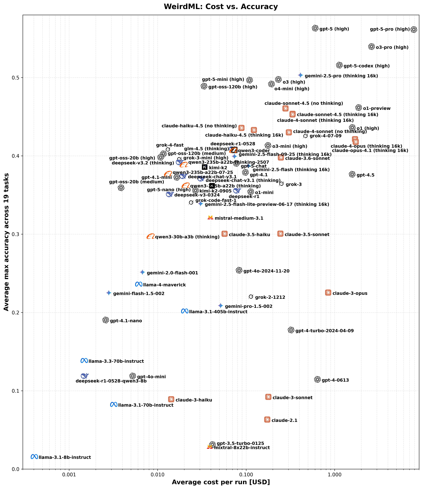
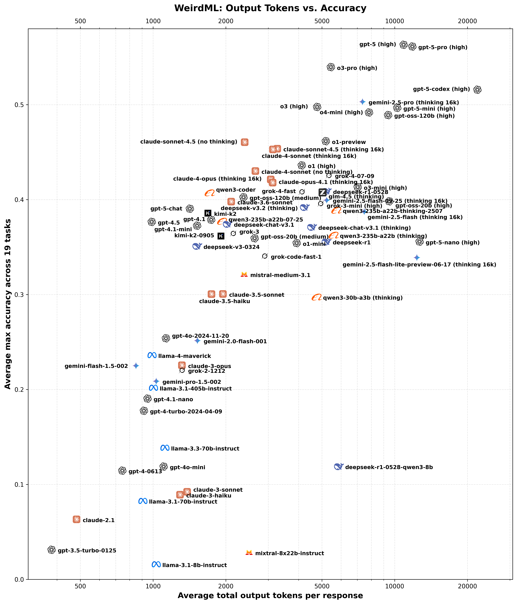
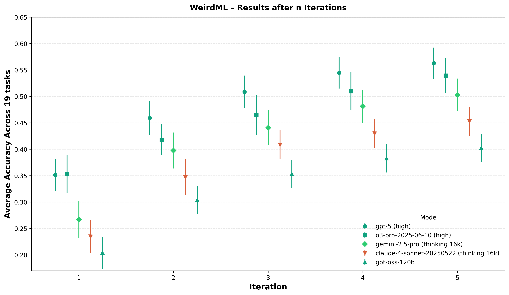
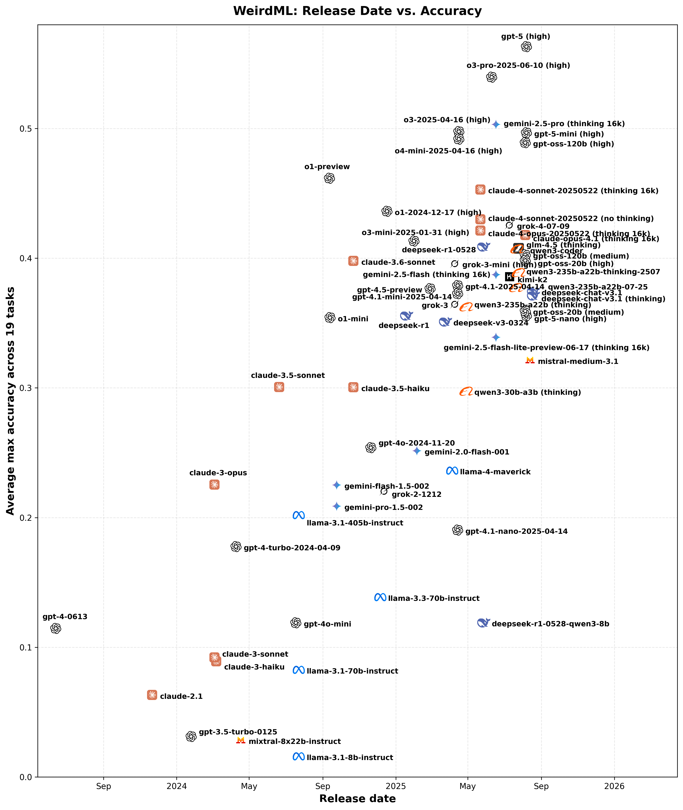
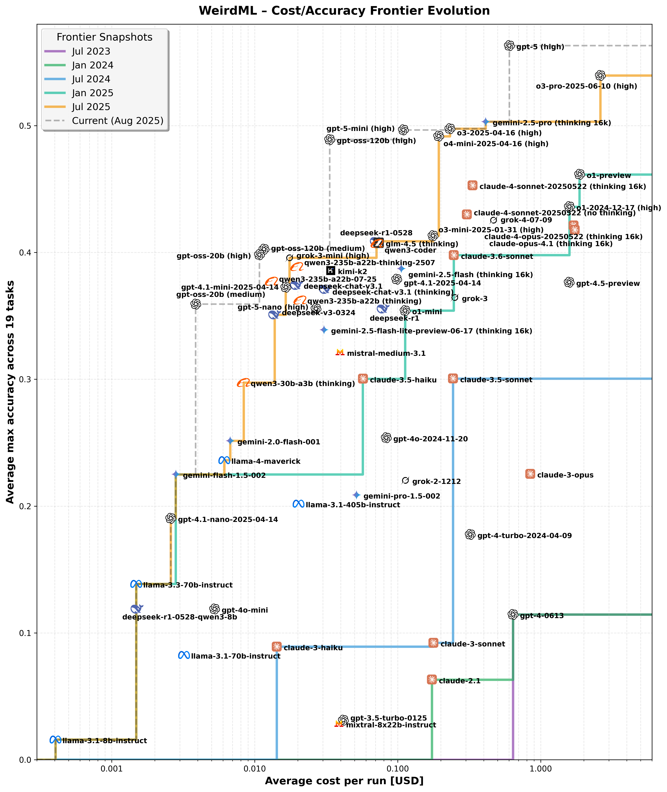
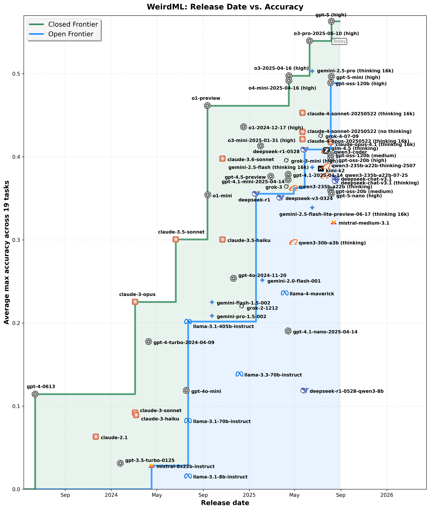
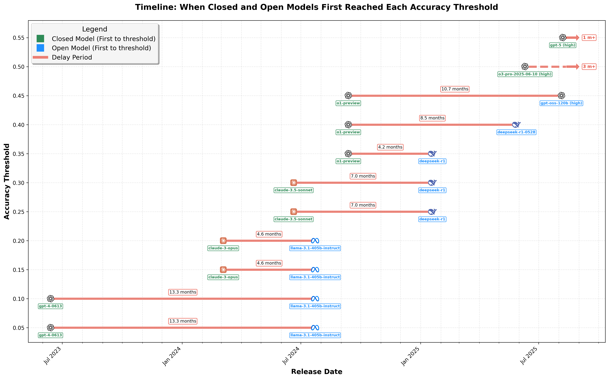

# WeirdML

  <strong>Version 2 of WeirdML is now out!</strong> We're also pleased to announce that WeirdML is now included in <a href="https://epoch.ai/data/ai-benchmarking-dashboard">Epoch AI's Benchmarking Hub</a>. We're grateful to <a href="https://metr.org">METR</a> for supporting the API costs of this project.

Most recent updates and discussion can be found on [X (@htihle)](https://x.com/htihle).

For the original WeirdML v1 results and analysis, visit the archived page: [WeirdML v1](weirdml_v1.html).

## Introduction

How good are Large Language Models (LLMs) at doing machine learning on novel datasets? The WeirdML benchmark presents LLMs with weird and unusual machine learning tasks, designed to require careful thinking and actual understanding to solve, and tests an LLM's ability to:

1. Actually understand the properties of the data and the problem
2. Come up with an appropriate ML architecture and training setup for the problem, and generate working PyTorch code that implements the solution
3. Debug and improve the solution over 5 iterations based on terminal output and the accuracy on the test set
4. Make good use of limited computational resources and time

Each task comes with a task prompt describing the problem precisely and some example code for loading data and saving predictions. The different tasks pose various challenges: some require heavy data augmentation, others need careful feature engineering, or require combining information from many different parts of the input.

## Results

[Explore the full WeirdML data](/weirdml_table.html) ([CSV]({{ "/data/weirdml_data.csv" | relative_url }}))

<a href="/weirdml_interactive.html" style="display: block; margin: 20px 0;">
  
   
  Open Interactive Plot →
</a>

### Topline Results

  
  
This figure provides a comprehensive summary of model performance across multiple metrics for models that have results for all included tasks. The 'Average Accuracy Across Tasks' column shows the overall mean accuracy (bold number) calculated as the average of the mean max accuracy for each task. That is, for each model, we take the maximum accuracy of the 5 iterations per run, we average these values over all the runs for a given task (typically 5 runs/model/task), then we average these results over all the 17 tasks. The thick horizontal bar represents the 95% confidence interval around this mean, estimated using bootstrap, reflecting the variability between different runs on each task. Individual task means are shown as scatter points, with distinct markers for each task type (see legend on top). The 'Cost per Run (USD)' column presents the average total cost incurred per model run, including all iterations. The 'Code Length (#Lines)' column illustrates the distribution of Python code lengths generated by each model, with the thick horizontal bar spanning the 10th to 90th percentile and a vertical line indicating the median number of lines. Finally, the 'Code Exec Time (s)' column displays a histogram of the execution times for all Python scripts generated by the model across all tasks.

  
  
This scatter plot visualizes the trade-off between the cost and the overall average accuracy across all tasks for each model. The X-axis (Average Cost per Run) is on a logarithmic scale, representing the total estimated cost in USD for a complete run including all iterations. The Y-axis (Average Max Accuracy) shows the overall mean accuracy, as detailed in the Model Performance Summary figure. The actual datapoints are in the middle of each company logo, not the text.

  
  
This scatter plot visualizes the trade-off between the number of output tokens and the overall average accuracy across all tasks for each model. The X-axis (Average total output tokens per response) is on a logarithmic scale, representing the total number of output tokens (reasoning tokens plus regular completion tokens). The Y-axis (Average Max Accuracy) shows the overall mean accuracy, as detailed in the Model Performance Summary figure. The actual datapoints are in the middle of each company logo, not the text.

  
  
Accuracy progression over five iterations. For each of the five highlighted models the marker shows the mean of the per-task "best-so-far" test accuracy after iteration n, averaged over all runs and all 17 WeirdML tasks; the vertical whiskers are 95% bootstrap confidence intervals. A single iteration (leftmost point) captures zero-shot code generation, while later points incorporate up to four rounds of feedback in the form of the test accuracy and terminal output from the python execution.

### Evolution of frontier over time

I have now added basically all the relevant frontier models back in time. Older models than mid-2023 are not included since they generally have too small context windows to solve the tasks, they would probably score very low as well. Notable missing models are o1-pro (this is too expensive to run) and gemini-1.0-ultra (not available in API any more).

  <video width="100%" controls autoplay loop muted>
    <source src="animations/WeirdML_task_evolution.mp4" type="video/mp4">
  </video>
  
This animation shows the evolution of state-of-the-art performance on each individual WeirdML task over time. At each point in time, the visualization displays the best score achieved so far on each task and which model holds that record. As time progresses, you can see records being broken and new models taking the lead on different tasks.

  
  
This scatter plot shows the relationship between model release dates and their achieved accuracy. Each icon corresponds to a model positioned according to its release date on the X-axis and its overall accuracy on the Y-axis, providing an overview of how model performance has progressed chronologically. The actual datapoints are in the middle of each company logo, not the text.

  <video width="100%" controls autoplay loop muted>
    <source src="animations/weirdml_cost_frontier.mp4" type="video/mp4">
  </video>
  
This animation shows the evolution of the cost-accuracy Pareto frontier over time. As time progresses, new models appear and the frontier (representing the best accuracy achievable at each cost level) shifts outward, illustrating the rapid improvements in model efficiency. Models that once defined the frontier are eventually surpassed by newer, more capable or cost-effective alternatives.

  
  
This figure illustrates the evolution of the cost-accuracy frontier over time, showing snapshots at six-month intervals from July 2023 to July 2025. Each colored curve represents the most cost-effective models (lowest cost for highest accuracy) available up to that date, highlighting rapid advancements in model efficiency and accuracy over the period. The icons represent individual models placed according to their cost per run (logarithmic X-axis) and overall accuracy (Y-axis). The actual datapoints are in the middle of each company logo, not the text.

### Open vs Closed Models

  
  
This scatter plot compares the progress of open-weights versus closed-weights models over time, plotting their release dates against their achieved accuracy. The step-like frontier curves represent the best accuracy achieved by open-weights (blue) and closed-weights (green) models, respectively, at any given time. Shaded regions emphasize periods where closed models held a clear accuracy advantage, highlighting the competitive dynamics between open and closed approaches. The actual datapoints are in the middle of each company logo, not the text.

  
  
This timeline visualizes the delays experienced by open-weights models in reaching various accuracy thresholds initially achieved by closed-weights models. Each horizontal line indicates the period from when a closed-weights model first reached an accuracy threshold (left icon) until an open-weights model achieved the same level (right icon). The annotated delays in months quantifies the gap between closed-weights models and open-weights models over time.

### Cost decrease over time

See blog post for more details: [Inference costs for hard coding tasks halve roughly every two months](https://www.lesswrong.com/posts/ifSBamvobbyB9KWjK/inference-costs-for-hard-coding-tasks-halve-roughly-every)

  
  
Here we see the cost to run the cheapest model that could achieve each 5% level of accuracy and how it declines over time. This is the average cost to solve a single task (in 5 iterations/model calls). We show the results for each accuracy level from 5% up to 55%, which is the highest 5% increment achieved to date.

  
  
Here we see the normalized cost (the cost at each time compared to the cost when the threshold was first achieved), and how that evolves over time for each threshold. We can then fit a curve to these data.

## Evaluation Setup

The evaluation uses an automated pipeline that:
1. Presents the task to the LLM
2. Executes the generated code in an isolated environment
3. Evaluates the results against the test set
4. Provides feedback (terminal output from the code execution and test accuracy) to the LLM for improvement

  
  
Evaluation pipeline showing the flow from LLM code generation through isolated execution to metric evaluation and feedback, with fixed computational constraints enforced via Docker.

### System Architecture

The system executes code in a Docker container with strict resource limits (TITAN V GPU with 12GB memory, 120-second timeout). This ensures fair comparison between models and tests their ability to work within realistic constraints.

Each 'run' is 5 iterations, i.e., the LLM gets 5 submissions, and 4 rounds of feedback, allowing them to learn from feedback and improve their solutions ([full system prompt](prompts/system_prompt_v2.md)). The accuracy of each run is the maximum test accuracy achieved over all the 5 submissions in that run.

For each task we give each model (at least) 5 runs (due to the high cost, o3-pro, claude-4-opus and gpt-4.5 only get 2 runs per task), in order to take into account the large variance in performance that we see for the same model on the same task. The final score for each model on that task is the mean accuracy over all the runs.

## Tasks

The LLMs are evaluated on several different machine learning tasks. These tasks are intended to be possible to solve with a very limited amount of data, while still being hard to solve. They should also require the LLMs to think clearly and actually understand the data and its properties, not just blindly apply a standard ML recipe.

Below is a more detailed description of the six first tasks, which are the ones that were used in WeirdML v1. I will not be sharing details about all the thirteen new tasks beyond the task names. So these six can be seen as example tasks, and the new tasks are a hidden test set that the models have not seen online before. We here also show results for each individual run on these six tasks, to give a better idea of the variance in performance for each model on each task, and how these tasks are getting saturated.

  
  
Example data from the Shapes (Easy) task. The shapes are always centered and have fixed orientation and size, making this the simpler variant of the shape recognition tasks.

### Shapes (Easy)

A shape classification task ([task prompt](prompts/task_prompt_shapes_easy.md)) where models must identify one of five shapes (circle, square, triangle, pentagon, star) from a set of 512 2D coordinates. Only some of the points make up the shape, the other points are noise. The shapes are always centered and have fixed orientation and size, making this the simpler variant of the shape recognition tasks. The training set has 1000 samples.

Here the model needs to come up with a way to encode the data that is invariant to permutations of the points. The distribution of points along the shape also varies greatly, so the model needs to combine information from many points to make a good prediction.

  
  
Maximum accuracy for each run on the Shapes (Easy) task by each model. The bars show the mean value over all the runs. The grey dots represent results for individual runs.

We can see from the figure that this task is basically solved at this point. If you are not careful in your architecture, it is very easy to completely overfit on the training data, but if you do something somewhat reasonable, it is not that hard to score basically perfect.

  
  
Example data from the Shapes (Hard) task. The shapes are randomly positioned, oriented, and sized, making this a more challenging variant of the shape recognition tasks.

### Shapes (Hard)

Similar to Shapes (Easy), but with random positioning, orientation, and size of the shapes ([task prompt](prompts/task_prompt_shapes_hard.md)). This tests the model's ability to create translation, rotation, and scale invariant features. Good data augmentation is also crucial on this one.

  
  
Maximum accuracy for each run on the Shapes (Hard) task by each model. The bars show the mean value over all the runs. The grey dots represent results for individual runs.

While similar in structure to the easy version, this task is much harder. In the easy task, when the shapes are always in the same positions, the model can learn what positions correspond to what shapes. This is not possible here, now you need to use the relative position of the different points in a rotationally invariant and scale invariant way, which is much harder.

While most models usually do little better than chance, the best models do consistently better, and we have a best score of almost 90%.

  
  
Example data from the Image Patch Shuffling (Easy) task. Models must arrange 9 shuffled grayscale image patches (9x9 pixels each) to reconstruct the original 27x27 image.

### Image Patch Shuffling (Easy)

Models must arrange 9 shuffled grayscale image patches (9x9 pixels each) to reconstruct the original 27x27 image. All patches are guaranteed to be part of a single, coherent image ([task prompt](prompts/task_prompt_shuffle_easy.md)). The training set has 1000 images.

The original images here are from the fashion MNIST dataset, which is a greyscale dataset of 28x28 images of fashion items, with the items of clothing in the middle against a black background. This means that the position of an individual patch can often be inferred from the patch itself, since for example, a patch in the left of the image will tend to contain the left side of the item of clothing etc. This allows you to get a decent score even if you are not combining the information from the different patches in a good way.

  
  
Maximum accuracy for each run on the Image Patch Shuffling (Easy) task by each model. The bars show the mean value over all the runs. The grey dots represent results for individual runs.

  
  
Example data from the Image Patch Shuffling (Hard) task. Models must arrange 9 shuffled RGB image patches (9x9 pixels each) from a random 27x27 subset of a larger 64x64 image.

### Image Patch Shuffling (Hard)

A more challenging version where patches are in RGB and taken from a random 27x27 subset of a larger 64x64 image ([task prompt](prompts/task_prompt_shuffle_hard.md)). The setup here is very similar to the easy version, but now you cannot infer the position of a patch from the patch itself, as the patches are taken from a random subset of the image (so a left patch can be taken from the center of the image). The original images are now also taken from imagenette (a subset of imagenet), which has a much more varied background and which makes it harder to infer the position of the individual patches. This means that the model needs to combine information from the different patches, and use the fact that the patches are supposed to fit well next to each other to make a good prediction.

  
  
Maximum accuracy for each run on the Image Patch Shuffling (Hard) task by each model. The bars show the mean value over all the runs. The grey dots represent results for individual runs.

  
  
Example data from the Chess Game Outcome Prediction task. Models must predict the outcome of chess games (white wins, black wins, or draw) from game move sequences given as strings (here truncated).

### Chess Game Outcome Prediction

Predict the outcome of chess games (white wins, black wins, or draw) from game move sequences ([task prompt](prompts/task_prompt_chess_winners.md)). The data consists of games played by beginners (rated below 1300), with moves in standard algebraic notation. Note that with 50% probability, the last move (for a single player) is removed, to prevent models using who moves last as a signal for the outcome. The training set has 1000 games.

Here the models need to split the string into moves, then convert the string for each move into some kind of hand-crafted or learned features, and finally use these features to predict the outcome of the game, while dealing with the variable length of the chess games. Once some good features are found, there should be plenty of patterns that can be used to do significantly better than chance on predicting the outcome of the games.

  
  
Maximum accuracy for each run on the Chess Game Outcome Prediction task by each model. The bars show the mean value over all the runs. The grey dots represent results for individual runs.

Simply guessing white wins always will give you about 50% here, which is why I put the "random chance" line at 50% for this task. There has not been much progress on this task since WeirdML v1, suggesting it is very hard to achieve above 80% here, although I still think it is possible to score better with the right approach.

  
  
Example data from the Unsupervised Digit Recognition task. Models must classify digits with only 26 labeled examples and a large set of unlabeled data.

### Unsupervised Digit Recognition

A semi-supervised learning task where models must classify digits with only 26 labeled examples and a large set of unlabeled data ([task prompt](prompts/task_prompt_digits_unsup.md)). The challenge is complicated by uneven class distribution in the unlabeled set. The unlabeled training set is almost 16000 samples.

This is perhaps the most straightforward task, as a fairly standard semi-supervised machine learning recipe can be applied, but it is at least a dataset that the models have not seen before, and making semi-supervised learning work at all is not trivial.

  
  
Maximum accuracy for each run on the Unsupervised Digit Recognition task by each model. The bars show the mean value over all the runs. The grey dots represent results for individual runs.

Here the models have improved a lot since WeirdML v1, and the best models now all consistently score well.
