

<!-- Hero -->

  <h1>WeirdML</h1>
  

    How good are LLMs at doing machine learning on novel, weird datasets?
    A benchmark that tests genuine understanding, not pattern matching.
  

  

    

      87
      Models evaluated
    

    

      17
      Tasks
    

    

      5
      Iterations per run
    

  

  WeirdML is included in <a href="https://epoch.ai/data/ai-benchmarking-dashboard">Epoch AI's Benchmarking Hub</a>. We're grateful to <a href="https://metr.org">METR</a> for supporting the API costs.
  Updates on <a href="https://x.com/htihle">X (@htihle)</a>.

<!-- Data tools -->

  <a href="/weirdml_summary.html" class="tool-card">
    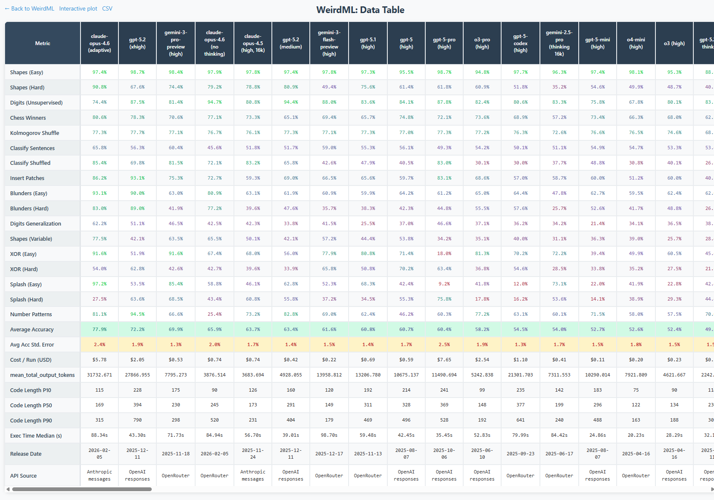
    

      
Model Overview

      
Performance summary across all models &mdash; accuracy, cost, code length, and execution time at a glance.

    

  </a>
  <a href="/weirdml_interactive.html" class="tool-card">
    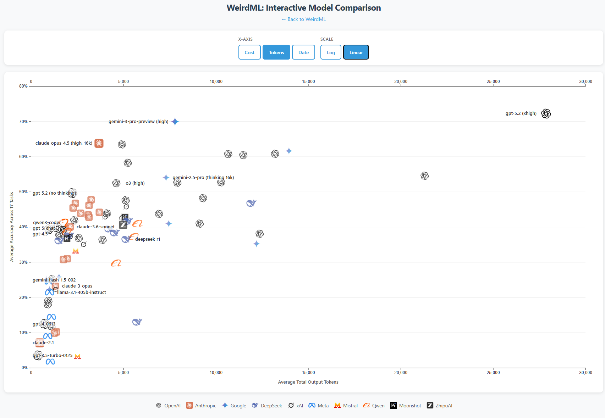
    

      
Interactive Explorer

      
Cost vs accuracy, tokens, release dates, open/closed frontiers &mdash; explore the data interactively.

    

  </a>
  <a href="/weirdml_table.html" class="tool-card">
    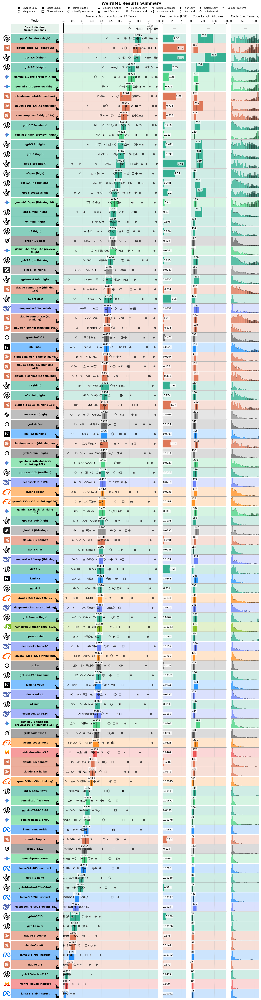
    

      
Full Data Table

      
Browse all 87 models across 17 tasks. Sort, filter, and download the raw CSV data.

    

  </a>

Analysis

<!-- Time Horizons: Featured -->

  <h2>Time Horizons: How Long Until LLMs Can Do Your Job?</h2>
  

    We estimate the <strong>time horizon</strong> of each frontier model &mdash; the duration of a human task at which the model has a 50% chance of success on WeirdML tasks. By fitting logistic curves per model and tracking the trend over generations, we can measure how quickly LLM capabilities are growing in concrete, human-relatable terms.
  

  

    

      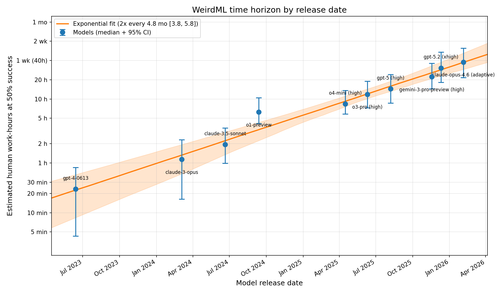
    

    

      
Time horizons double roughly every 5 months

      

        From <strong>~24 minutes</strong> (GPT-4, June 2023) to <strong>~38 hours</strong> (Claude Opus 4.6, February 2026). Tasks that would take a human half a day are now within reach of frontier models &mdash; and the trend shows no sign of slowing down.
      

      

        Each model's time horizon is estimated via bootstrap with 5000 resamples, giving robust uncertainty quantification. The exponential trend fit uses 10,000 bootstrap iterations across all 10 frontier models.
      

    

  

  

    
Model-by-model time horizons

    

      <table class="timeline-table">
        <thead>
          <tr>
            <th>Model</th>
            <th>Release</th>
            <th>Time Horizon (50%)</th>
            <th>95% CI</th>
          </tr>
        </thead>
        <tbody>
          <tr><td>gpt-4-0613</td><td>Jun 2023</td><td>24 min</td><td>[4 min, 51 min]</td></tr>
          <tr><td>claude-3-opus</td><td>Mar 2024</td><td>1.1 h</td><td>[16 min, 2.3 h]</td></tr>
          <tr><td>claude-3.5-sonnet</td><td>Jun 2024</td><td>1.9 h</td><td>[59 min, 3.5 h]</td></tr>
          <tr><td>o1-preview</td><td>Sep 2024</td><td>6.2 h</td><td>[4.2 h, 10.5 h]</td></tr>
          <tr><td>o4-mini (high)</td><td>Apr 2025</td><td>8.4 h</td><td>[5.8 h, 13.6 h]</td></tr>
          <tr><td>o3-pro (high)</td><td>Jun 2025</td><td>11.8 h</td><td>[7.2 h, 18.9 h]</td></tr>
          <tr><td>gpt-5 (high)</td><td>Aug 2025</td><td>14.5 h</td><td>[8.6 h, 24.1 h]</td></tr>
          <tr><td>gemini-3-pro (high)</td><td>Nov 2025</td><td>22.3 h</td><td>[14.4 h, 36.2 h]</td></tr>
          <tr><td>gpt-5.2 (xhigh)</td><td>Dec 2025</td><td>30.6 h</td><td>[18.3 h, 54.4 h]</td></tr>
          <tr><td>claude-opus-4.6 (adaptive)</td><td>Feb 2026</td><td>37.7 h</td><td>[21.6 h, 62.4 h]</td></tr>
        </tbody>
      </table>
    

  

<!-- Further Analysis Grid -->

  

    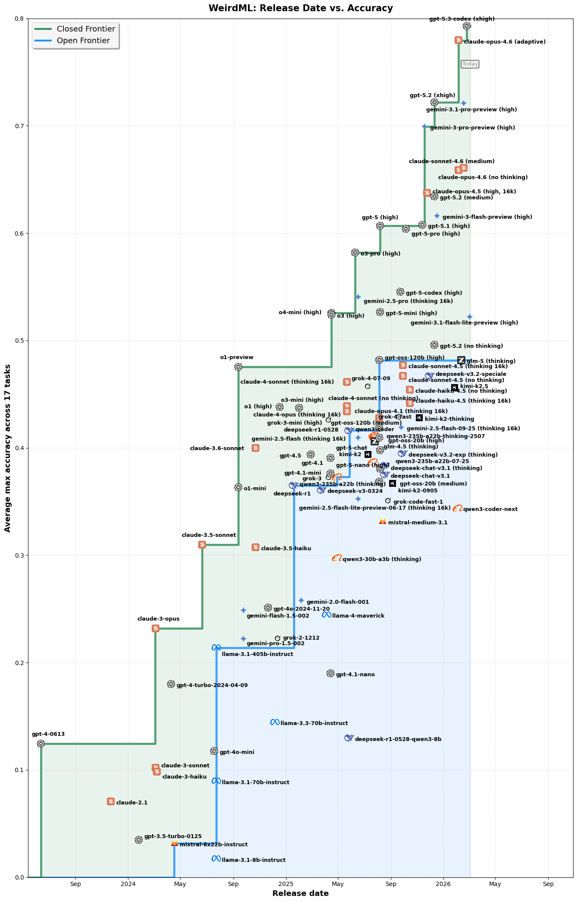
    

      <h3>Open vs Closed Models</h3>
      
How quickly do open-weights models catch up to closed-weights frontier performance? Step-frontier analysis shows the competitive dynamics.

    

  

  

    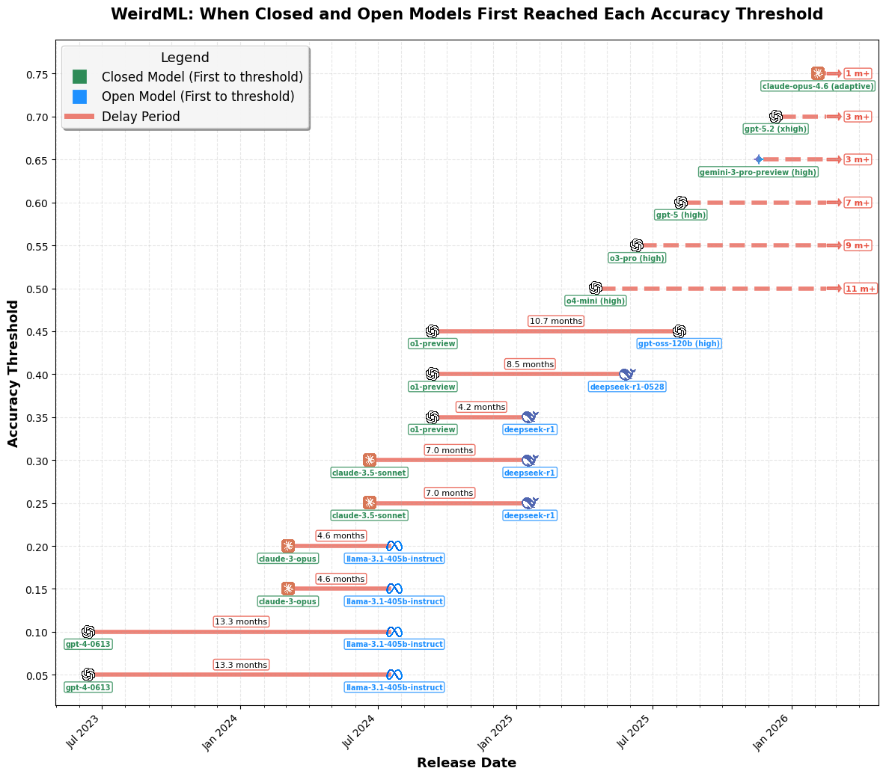
    

      <h3>Open Model Delay Timeline</h3>
      
The time gap between when a closed model first reaches an accuracy threshold and when an open model matches it.

    

  

  

    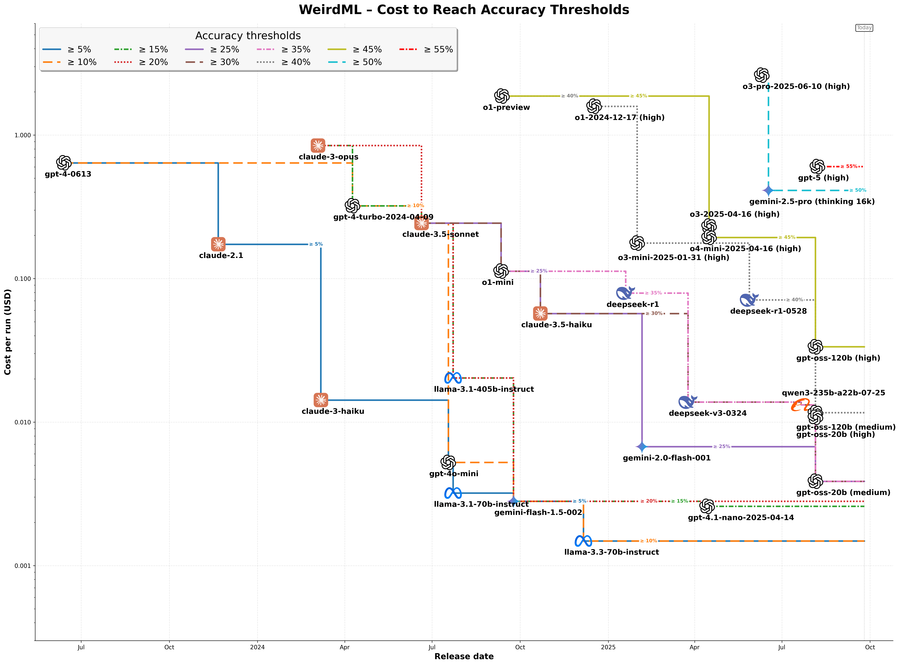
    

      <h3>Cost Decrease Over Time</h3>
      
Inference costs for hard coding tasks halve roughly every two months. See <a href="https://www.lesswrong.com/posts/ifSBamvobbyB9KWjK/inference-costs-for-hard-coding-tasks-halve-roughly-every">the blog post</a> for details.

    

  

  

    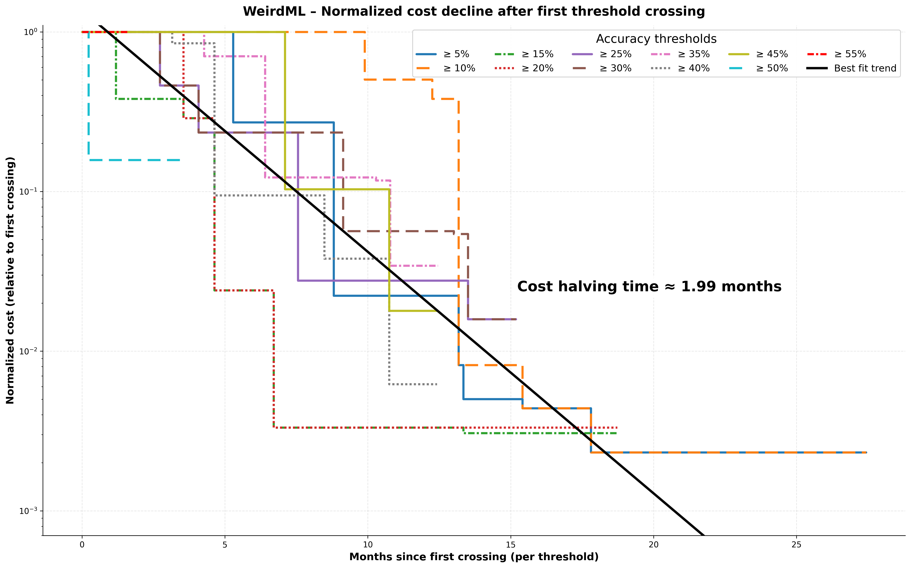
    

      <h3>Normalized Cost Decline</h3>
      
Cost relative to when each accuracy threshold was first achieved, showing the consistent exponential decline across thresholds.

    

  

Evolution of the Frontier

  

    <video width="100%" autoplay loop muted playsinline>
      <source src="animations/WeirdML_task_evolution.mp4" type="video/mp4">
    </video>
    

      <h3>Task-by-Task Evolution</h3>
      
Watch how state-of-the-art performance on each individual WeirdML task progresses over time, with records falling as new models appear.

    

  

  

    <video width="100%" autoplay loop muted playsinline>
      <source src="animations/weirdml_cost_frontier.mp4" type="video/mp4">
    </video>
    

      <h3>Cost-Accuracy Frontier</h3>
      
The Pareto frontier of cost vs accuracy shifts outward over time as newer models push the boundary of what's achievable.

    

  

  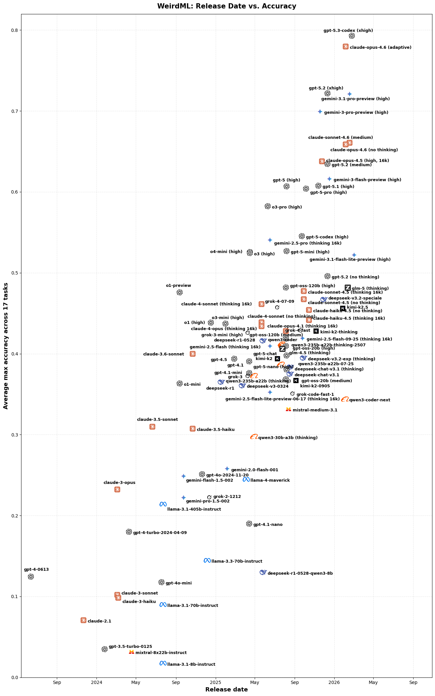
  
Chronological scatter of all models, showing the overall trajectory of accuracy improvement since mid-2023.

  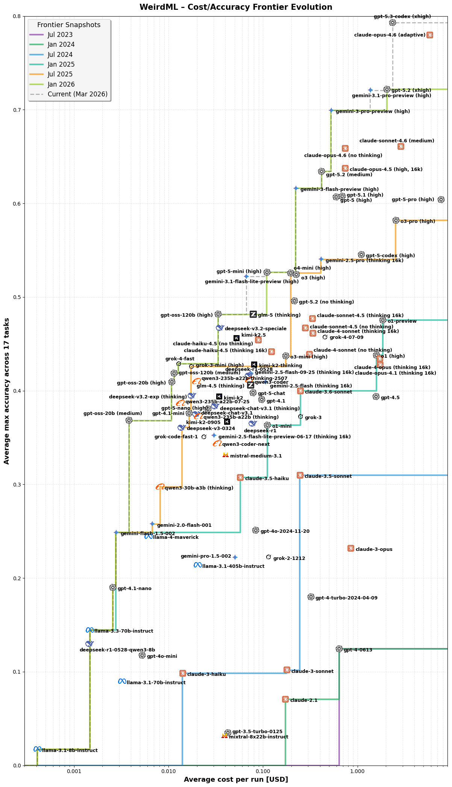
  
Snapshots of the cost-accuracy Pareto frontier at six-month intervals from July 2023 to July 2025.

Topline Results

  
  
Comprehensive summary of model performance. Average accuracy (bold, with 95% CI from bootstrap), individual task means (scatter points), cost per run, code length distribution, and execution time histograms.

  

    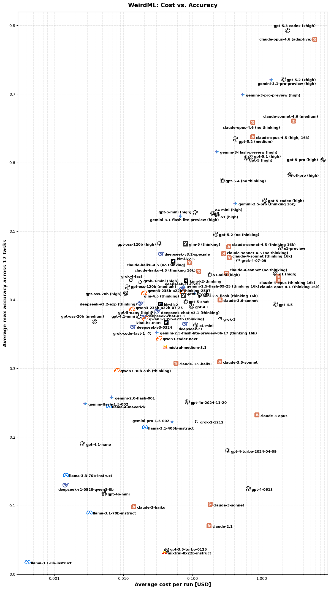
    

      <h3>Cost vs Accuracy</h3>
      
The trade-off between cost per run and overall accuracy across all models (log scale).

    

  

  

    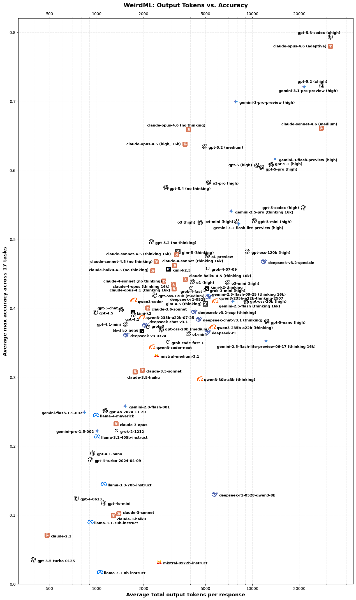
    

      <h3>Tokens vs Accuracy</h3>
      
Total output tokens (including reasoning) vs accuracy. More thinking doesn't always help.

    

  

  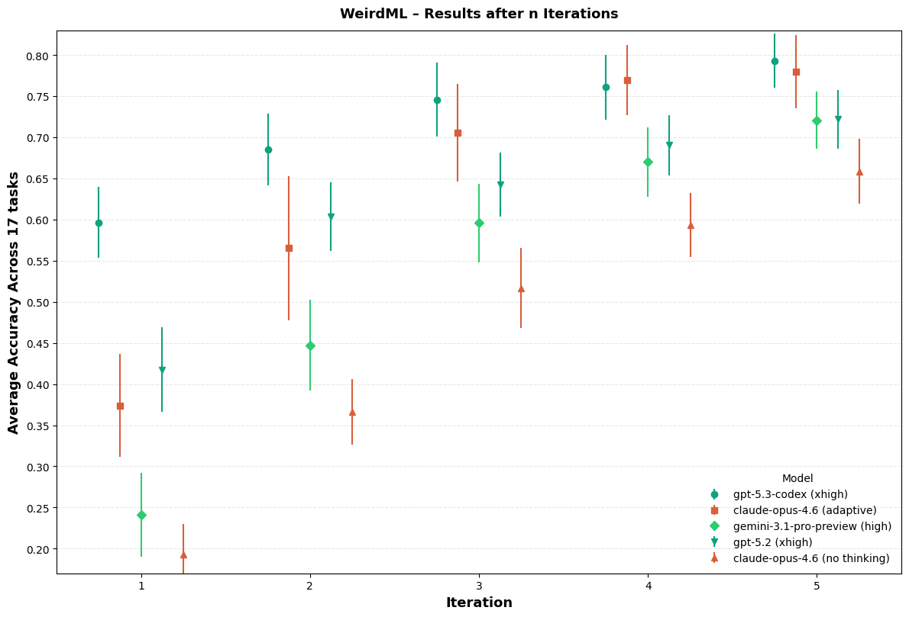
  
Accuracy progression over five iterations for selected models. The leftmost point is zero-shot; later points incorporate feedback from execution output and test accuracy.

Methodology

## How It Works

WeirdML presents LLMs with weird and unusual ML tasks, designed to require careful thinking and genuine understanding. Each model must:

1. **Understand** the data properties and problem structure
2. **Design** an appropriate ML architecture and training setup
3. **Generate** working PyTorch code implementing the solution
4. **Debug** and improve over 5 iterations based on terminal output and test accuracy
5. **Optimize** within strict computational constraints (TITAN V GPU, 12GB, 120s timeout)

  
  
Evaluation pipeline: LLM code generation, isolated Docker execution, metric evaluation, and feedback loop.

Each model gets at least 5 runs per task (some expensive models get 2) to account for the high variance in performance. The final score is the mean of the maximum test accuracy achieved across the 5 iterations in each run, averaged over all runs and tasks. See the [full system prompt](prompts/system_prompt_v2.md).

Example Tasks

Below are six of the 17 tasks (the original WeirdML v1 set). The remaining 11 tasks serve as a hidden test set.

### Shapes (Easy)

Classify one of five shapes from 512 2D coordinates, where only some points form the shape and the rest are noise. Shapes are centered with fixed orientation.

  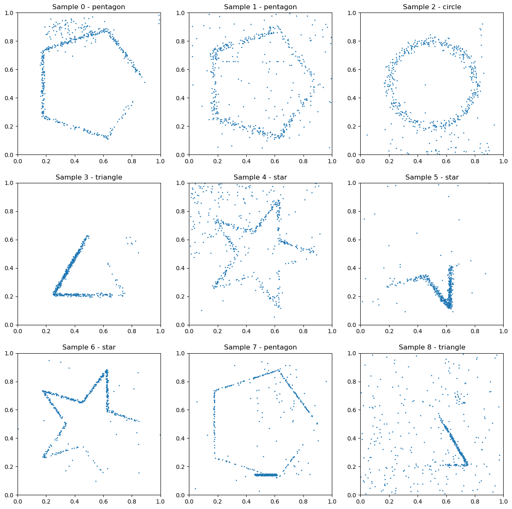

  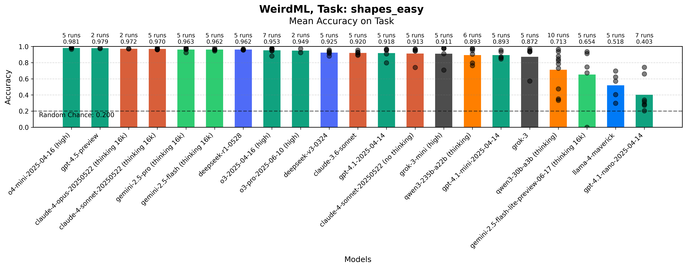
  
This task is essentially solved. Most capable models achieve near-perfect accuracy.

### Shapes (Hard)

Same as above, but shapes are randomly positioned, oriented, and sized. Requires translation, rotation, and scale invariant features.

  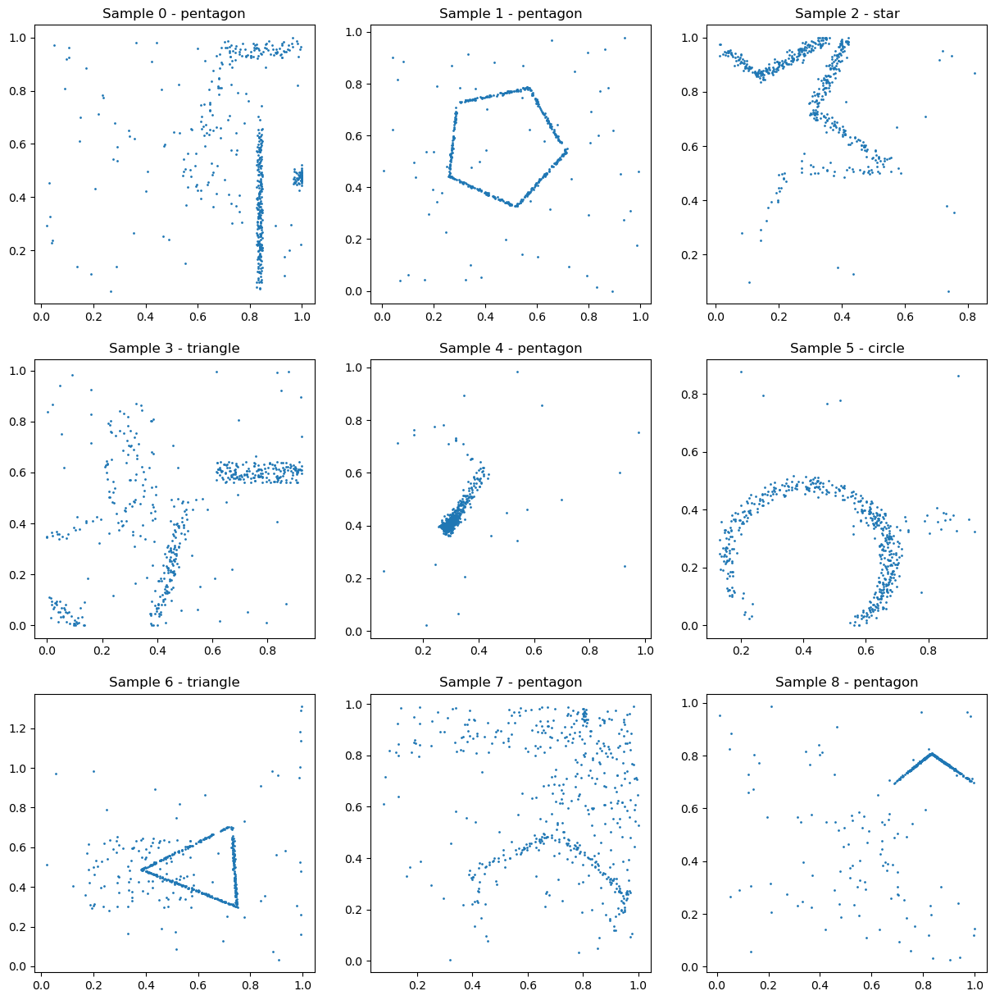

  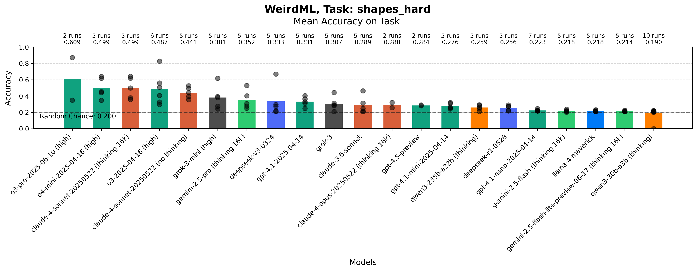
  
Much harder than the easy variant. Most models do little better than chance, but the best achieve ~90%.

### Image Patch Shuffling (Easy)

Arrange 9 shuffled grayscale image patches (9x9 pixels) to reconstruct a 27x27 image from Fashion-MNIST.

  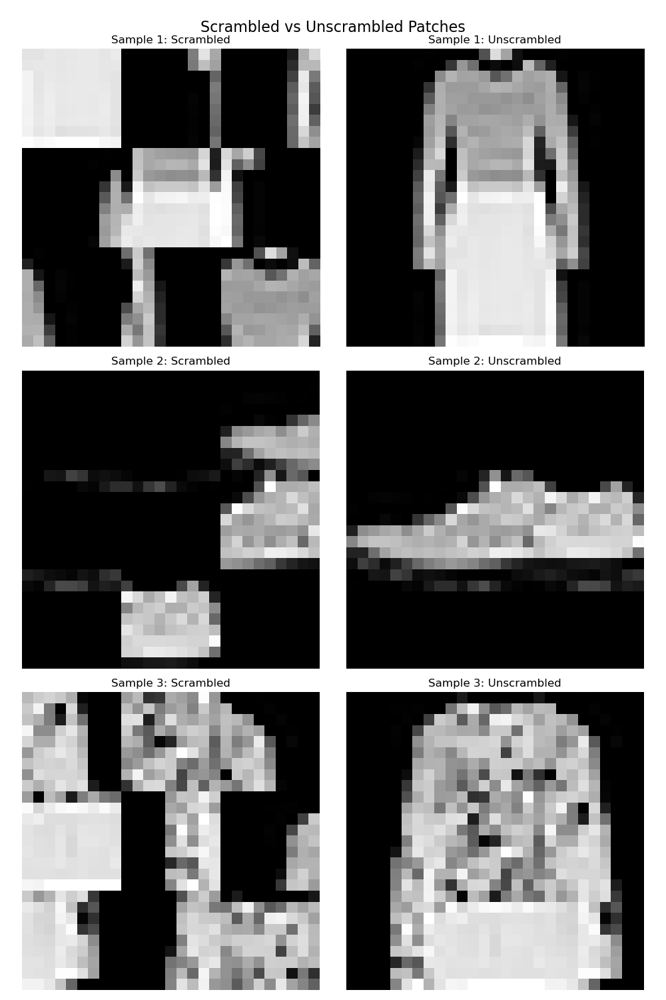

  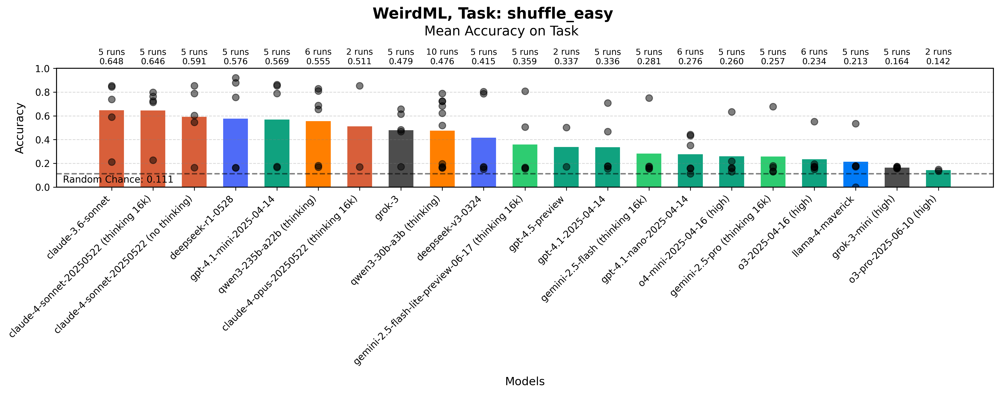

### Image Patch Shuffling (Hard)

RGB patches from random subsets of ImageNette images. Position can't be inferred from individual patches &mdash; requires combining information across patches.

  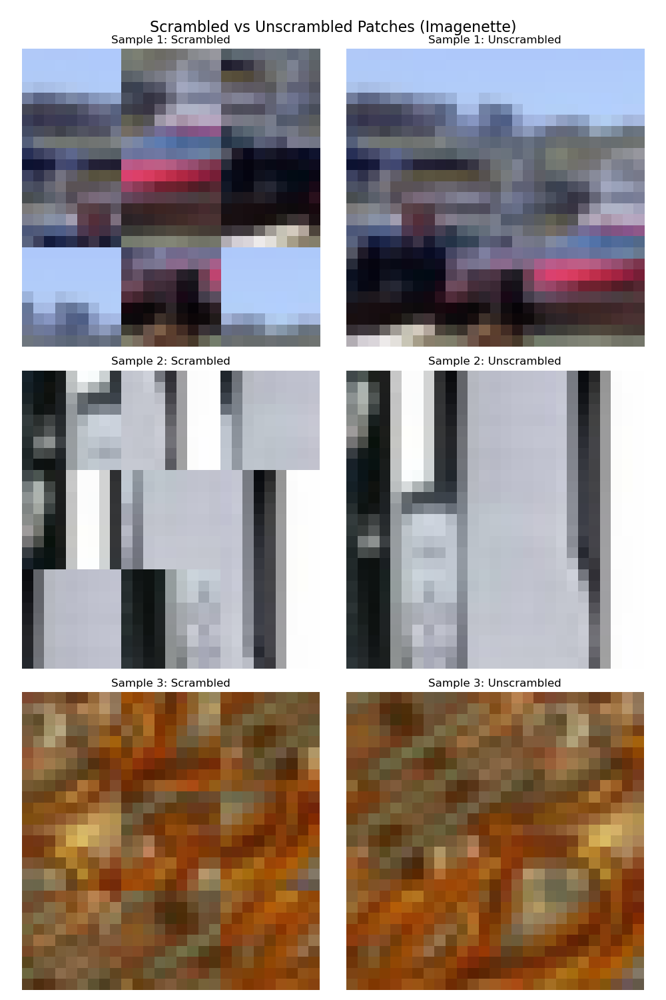

  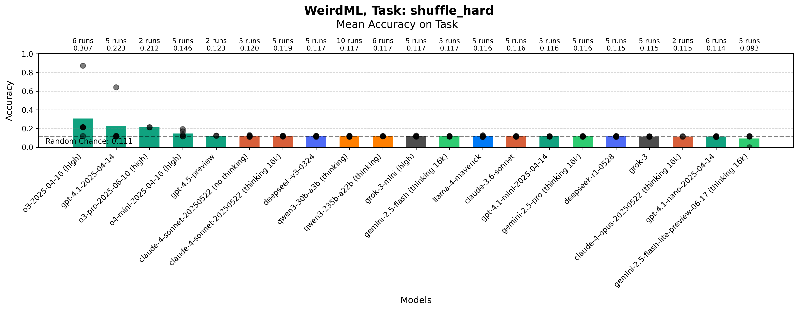

### Chess Game Outcome Prediction

Predict the outcome (white wins, black wins, draw) from move sequences of beginner-level games.

  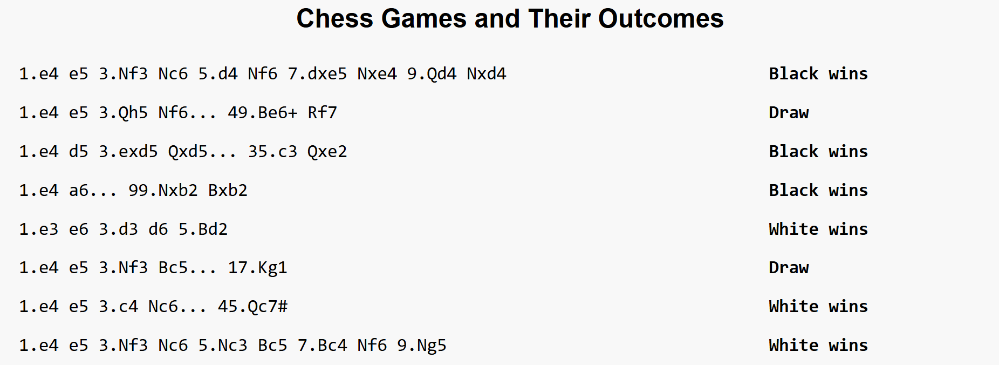

  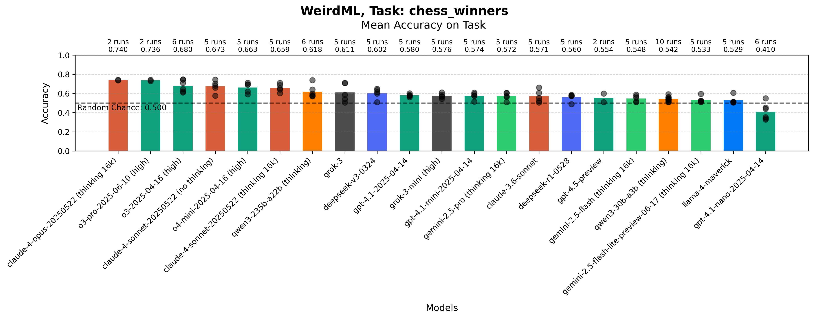
  
Random baseline is ~50% (always guess white). Little progress beyond 80%, suggesting this task is genuinely hard.

### Unsupervised Digit Recognition

Semi-supervised: classify digits with only 26 labeled examples and ~16,000 unlabeled samples with uneven class distribution.

  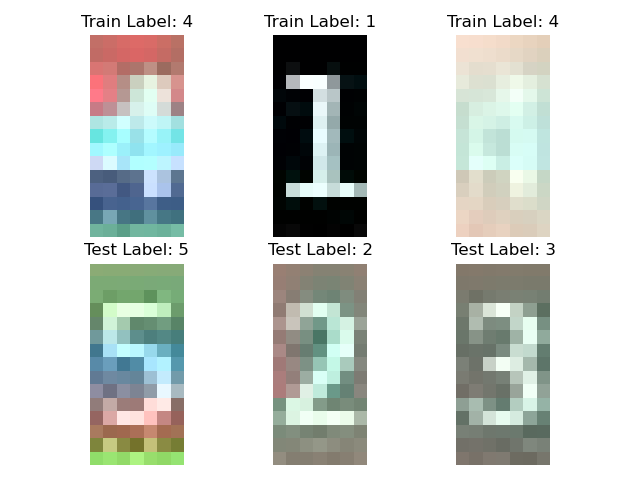

  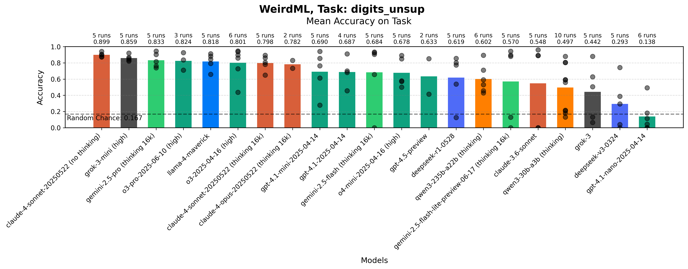
  
Large improvement since v1. Best models now consistently score well.

---

*For the original WeirdML v1 results, see the [archived page](weirdml_v1.html).*
